Anim Picker User Documentation
###############################

The **Anim Picker** is mGear's picker tool for animators: a graphical board of
buttons that select and drive a rig's controls, so you can pose a character
without hunting for controllers in the viewport. Version **2.0** is a full
rewrite of the original picker with a modern editor, vector (SVG) shapes,
interactive widgets, viewport pins, conditional visibility, mirroring and a
click-through "heads-up display" mode.

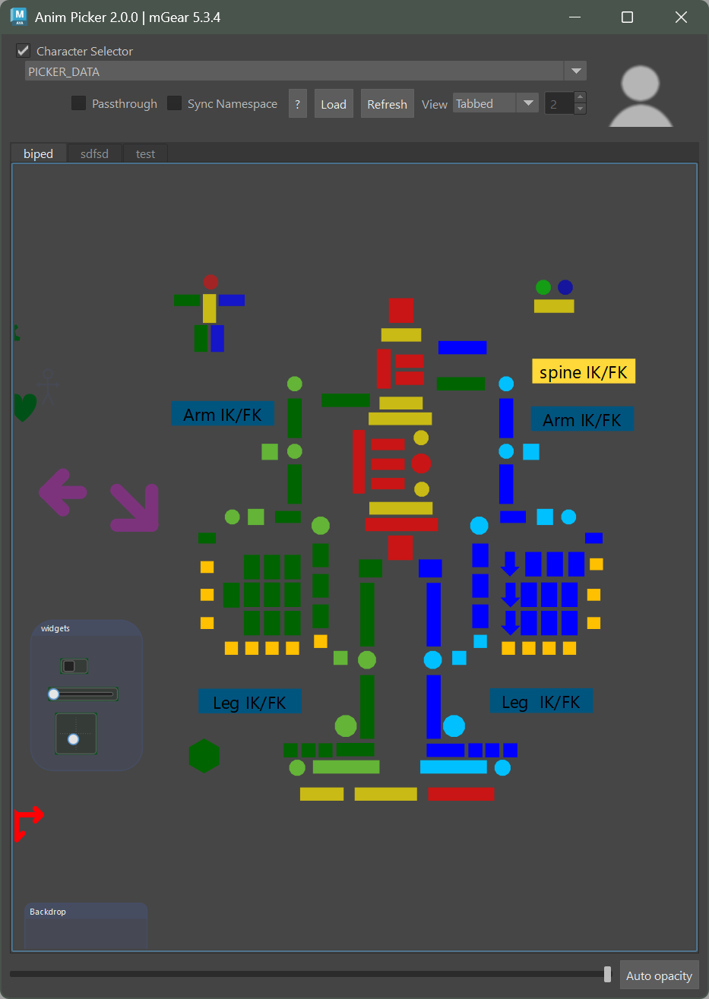

A picker is stored **per Maya scene** on a ``PICKER_DATAS`` node (as clean
JSON), and can also be exported to / imported from a ``.pkr`` file to reuse it
across scenes and characters.

Opening the Anim Picker
========================

From the mGear menu (**mGear ▸ Anim Picker**) you have three entries:

* **Anim Picker:** the floating animation window (the picker you pose with).
* **Anim Picker (Dockable):** the same animation window, dockable into Maya's
  UI as a workspace control.
* **Edit Anim Picker:** the editor, where you build and lay out the picker.

You can also open it from Python:

.. code-block:: python

    from mgear import anim_picker
    anim_picker.load()              # animation mode (floating)
    anim_picker.load(dockable=True) # animation mode (dockable)
    anim_picker.load(edit=True)     # edit mode

The Animation window
=====================

The top bar drives which picker is loaded and how it behaves:

* **Character Selector:** the collapsible header holds the picker-data combo
  box (which ``PICKER_DATAS`` node to show) and a snapshot picture of the
  character. Uncheck the group title to collapse it.
* **Passthrough:** turns this window into a click-through overlay (see
  `Opacity passthrough`_).
* **Sync Namespace:** when on, the picker resolves its controls in the
  namespace of your current selection, so one picker drives any referenced
  instance of the rig.
* **Load / Refresh:** load a picker from a ``.pkr`` file, or re-read the data
  node and re-sync the widgets to the rig.
* **View:** **Tabbed** shows one tab at a time; **Tiled** shows several tabs
  side by side (the spinbox sets the column count).
* **Tabs:** a picker can hold several pages (e.g. *body*, *face*); click a tab
  to switch.

**Selecting controls:** click an item to select its associated control(s).
Hold **Shift** to add to the selection, **Ctrl** to toggle, and drag on empty
canvas to marquee-select. Panning is **middle-mouse drag**, zooming is the
**mouse wheel**, and **F** frames the content.

At the bottom, the **opacity slider** fades the whole window, and **Auto
opacity** makes it fade automatically while the mouse is away and become opaque
on mouse-over — handy for keeping the picker on screen without hiding the
viewport.

Opacity passthrough
--------------------

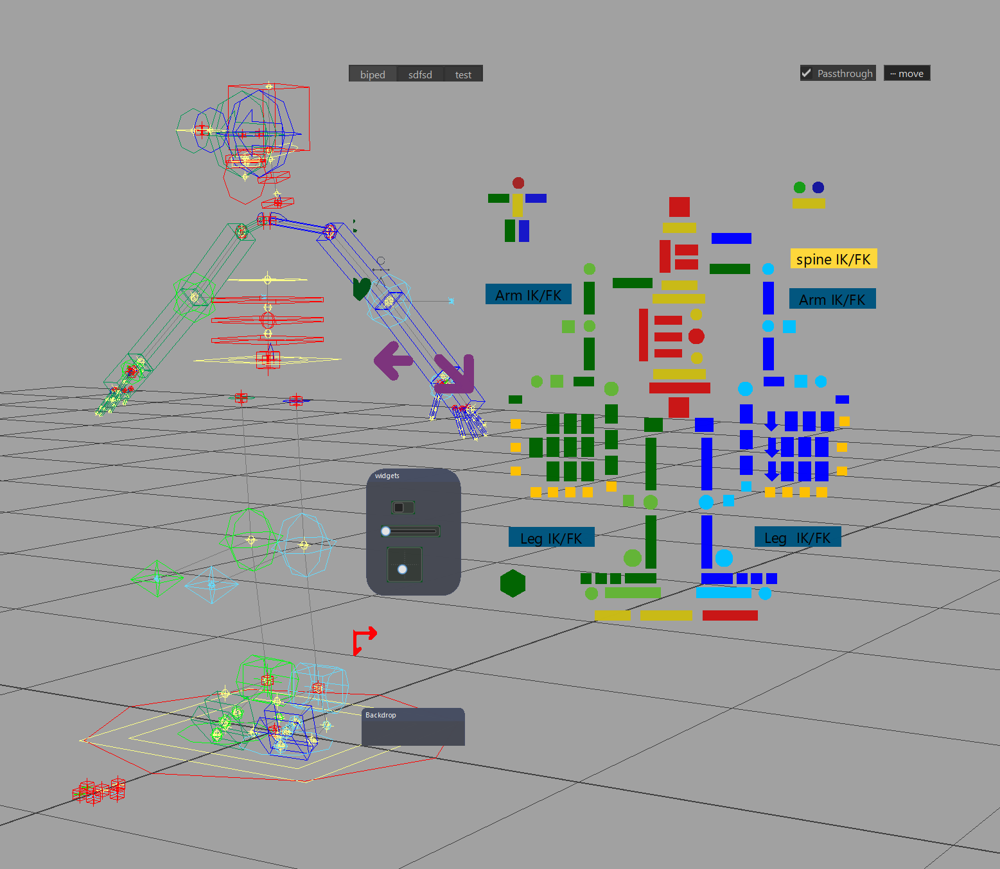

Passthrough turns the floating picker into a HUD you can click **straight
through**. Check the **Passthrough** box and, while the window is transparent
(opacity below 100%) with **Auto opacity off**, everything except the item
buttons and the tabs becomes see-through and **click-through** — clicking an
empty gap selects and manipulates the rig in the viewport behind, without
moving the picker aside. Each item is cut on its real shape, so vector buttons
follow their outline.

* Checking the box on a fully opaque window drops it to a transparent default
  so it engages in one click; unchecking restores the solid window (your last
  transparency is remembered).
* A small **"··· move"** grip and a second **Passthrough** checkbox appear at
  the top-right (the in-row checkbox is hidden while masked), so you can drag
  the window and switch passthrough off without leaving the mode.
* During a **pan or zoom the full window comes back** and moves smoothly, then
  re-masks the moment you stop.
* Passthrough is **per-window**: enabling it on one open picker does not affect
  the others. It applies to the floating window only.

Edit mode
=========

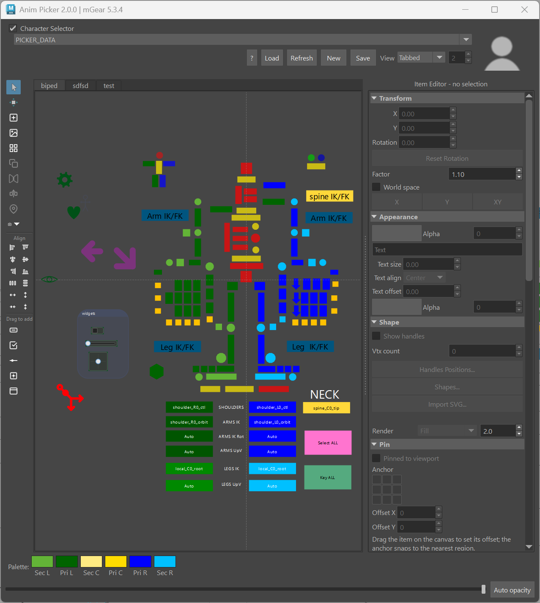

The editor adds a **left tool strip**, a **color palette** along the bottom,
and the **Item Editor** panel on the right. **New** creates a fresh picker on a
data node; **Save** writes the current picker to a ``.pkr`` file.

.. note::

    Every change in edit mode is recorded to an **undo / redo stack** (per
    tab). Use **Ctrl+Z** / **Ctrl+Shift+Z**, and the usual **Ctrl+C / V / X**
    (copy / paste / cut), **Ctrl+D** (duplicate), **Ctrl+Shift+D** (duplicate &
    mirror), **Delete**, **Ctrl+A** (select all), **arrow keys** to nudge
    (**Shift** for a larger step), **F** to frame and **Esc** to clear the
    selection. Shortcuts fire only while the picker has focus, so they never
    leak into Maya's global hotkeys.

The tool strip
--------------

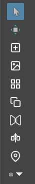

The top of the strip holds the canvas tools:

* **Select** and **Transform:** switch between selecting items and showing the
  move / scale / rotate manipulator to transform them on the canvas.
* **Add item:** drop a new default button on the canvas.
* **Add background image:** add an image layer behind the items.
* **Shape library:** open the shape picker (see `Shapes`_).
* **Duplicate** and **Mirror:** copy the selection, or mirror it across the
  symmetry axis (with an optional name search / replace so the copies target
  the opposite-side controls).
* **Pin:** pin the selected items to a viewport corner as an on-screen HUD
  (see `Pin`_).
* **Trace from rig:** auto-generate a picker from the rig's control layout
  (see `Auto-build from the rig`_).

Auto-build from the rig
-----------------------

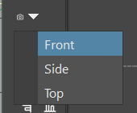

The camera drop-down at the bottom of the tool strip **builds a picker straight
from the rig**. It looks at the scene's controls from a **Front / Side / Top**
view and traces the **convex hull** of each control, creating a picker item per
control laid out to match the rig's spatial distribution — a fast way to get
the whole control layout in one step, which you then refine (shapes, colors,
grouping).

Aligning and distributing
-------------------------

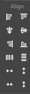

The **Align** section lines the selected items up (left / right / top / bottom
/ center, horizontally or vertically), distributes them evenly, and
**expands / contracts** their spacing a step at a time about the selection's
center — quick ways to tidy a row or column of buttons.

Drag to add — widgets & backdrops
---------------------------------

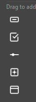

The **Drag to add** section lets you drag ready-made items onto the canvas:
interactive **widgets** (checkbox, slider, 2D slider), a plain **button**, and
a **backdrop**. Drop one where you want it, then configure it in the Item
Editor.

Building items
==============

Shapes
------

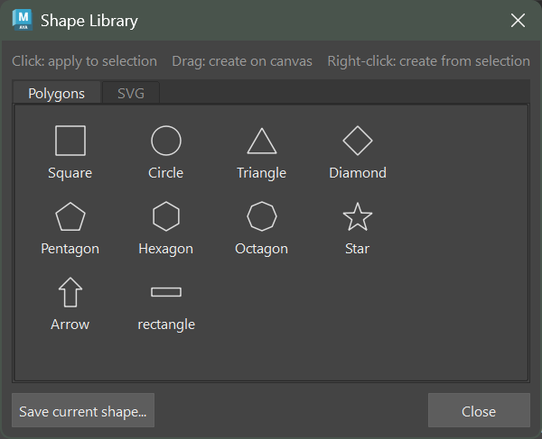

The **Shape Library** (tool strip, or the Item Editor's **Shapes...** button)
holds ready shapes across two tabs — **Polygons** (square, circle, triangle,
diamond, pentagon, hexagon, octagon, star, arrow, rectangle …) and **SVG**
(curved / organic icons like gear, heart, eye, hand). There are three ways to
use a tile:

* **Click** — apply that shape to the selected item(s).
* **Drag** — create a new item with that shape at the drop point.
* **Right-click** — **create from selection**: one item per selected Maya
  control, laid out in a row or column and each linked to (and colored from)
  its control.

**Save current shape...** stores the active item's shape (polygon or vector)
into your user library for reuse.

You can also build a shape from Maya curves: draw the outline as NURBS curves,
select them, and the picker traces them into an item's shape.

The Item Editor
===============

Selecting an item in edit mode fills the **Item Editor** panel on the right.
Its sections cover every property of the item; the most-used ones are open by
default.

Transform
---------

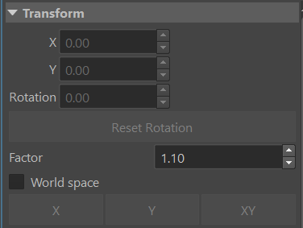

Position (**X / Y**) and **Rotation** of the item, a **Reset Rotation**
button, and a **Factor** with **X / Y / XY** buttons to scale the selection by
that factor (uniformly or on one axis). **World space** toggles whether the
transform is read in scene or local space.

Appearance
----------

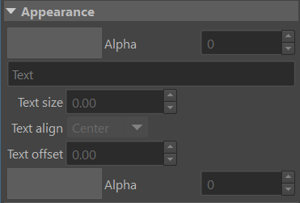

The item's **color** and **Alpha** (transparency), an optional **Text** label
with its **size**, **alignment** and **offset**, and the text's own color /
alpha. Text is stored display-independently so it looks right across monitors,
and scales on high-DPI screens.

Shape
-----

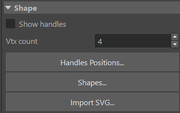

Controls for the item's outline: **Show handles** to edit the polygon points
on the canvas, the **Vtx count**, **Handles Positions...** for numeric point
entry, **Shapes...** to open the library, and **Import SVG...** to load a
vector shape from a ``.svg`` file. Vector items expose a **Render** mode
(**Fill** or **Stroke**) and a stroke width. (Vector items have no editable
points, so *Show handles* is a no-op for them.)

Controls
--------

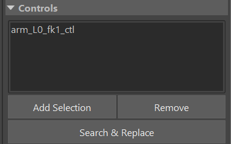

The Maya control(s) this item selects. **Add Selection** links the currently
selected controls, **Remove** unlinks the highlighted one, and **Search &
Replace** rewrites the names in bulk (e.g. ``_L0_`` → ``_R0_``) — the quick way
to retarget mirrored buttons.

Action
------

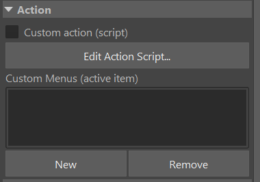

Give the item behaviour beyond selection. **Custom action (script)** runs a
Python script when the item is clicked (**Edit Action Script...**), and
**Custom Menus** add right-click menu entries with their own scripts.

Widgets
-------

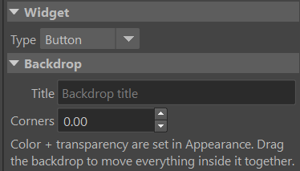

The **Type** drop-down turns a plain button into an **interactive widget** that
reads and drives a rig attribute directly in the picker:

* **Checkbox** — toggles a boolean attribute (or master-controls the
  visibility of an item **group**, see `Visibility`_).
* **Slider** — drags a single attribute between a min and max.
* **2D slider** — drives two attributes (X / Y) at once from one handle.

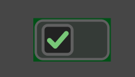

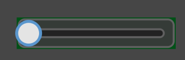

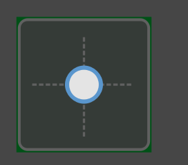

Each widget is bound to its attribute(s) and range in the editor, and stays in
sync with the rig on selection / time change.

Backdrop
--------

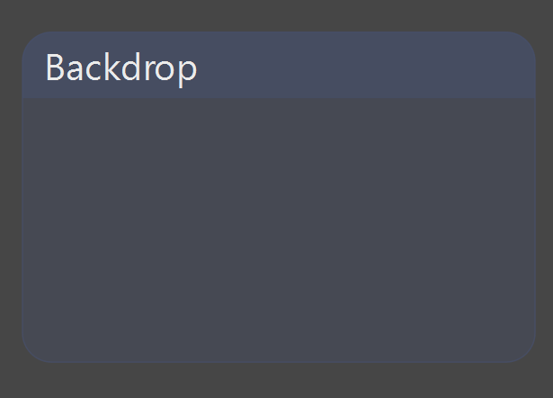

A **backdrop** is a titled panel drawn behind other items to group them
visually. Set its **Title** and **Corners** (rounding); its color and
transparency come from **Appearance**. Dragging the backdrop moves everything
sitting on top of it together.

Visibility
----------

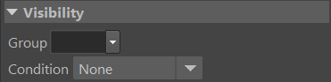

Show or hide the item conditionally:

* **Group** — tag the item into a named group. A **checkbox** widget set to
  *control* that group can then show / hide every item in it at once (with an
  optional invert), right in the picker and with no rig attribute required.
* **Condition** — show the item only by **zoom level** or by a **channel
  state** (e.g. an *IK* button visible only when the limb is in IK). Conditions
  and groups compose: a grouped item with its own condition is shown only when
  its group is shown **and** its condition passes.

Edit mode always shows every item, so conditional visibility never blocks
authoring.

Pin
---

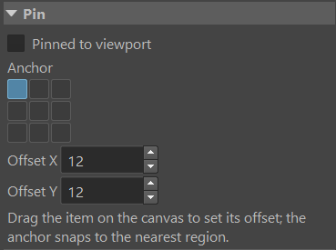

**Pinned to viewport** locks the item to a fixed spot on the canvas — it keeps
its screen position and size through pan and zoom, so it works as an on-screen
HUD button (a corner reset, a space switch, a settings button…). Pick the
**Anchor** cell (3×3) it sticks to and an **Offset**, or just drag the item on
the canvas to set the offset (the anchor snaps to the nearest region).

Mirror
------

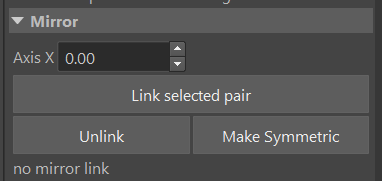

Link a left / right pair so edits propagate symmetrically. Set the **Axis X**
(the mirror line), **Link selected pair**, and thereafter moving or editing one
side updates its partner. **Make Symmetric** matches one side to the other, and
**Unlink** breaks the relationship.

Color palette
=============

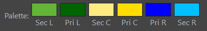

The palette along the bottom of the editor holds quick colors — secondary /
primary for **Left / Center / Right** — so you can color a selection with one
click and keep a consistent left/right convention across the board.

Saving and sharing pickers
==========================

A picker lives on a ``PICKER_DATAS`` node in the scene (stored as JSON), so it
travels with the file. Use **Save** to export the current picker to a ``.pkr``
file and **Load** to bring one in — the way to reuse a picker across scenes or
share it with a team.

.. note::

    **mGear 5.x note:** picker data is stored as clean JSON. A picker that
    lived **only** on a scene node in a much older version (with no ``.pkr``
    file) is not auto-migrated and should be re-exported once; ``.pkr`` files
    and file-backed pickers are unaffected.
