Anim Picker User Documentation
###############################

The **Anim Picker** is mGear's picker tool for animators: a graphical board of
buttons that select and drive a rig's controls, so you can pose a character
without hunting for controllers in the viewport. Version **2.0** is a full
rewrite of the original picker with a modern editor, vector (SVG) shapes,
interactive widgets, viewport pins, conditional visibility, mirroring and a
click-through "heads-up display" mode.

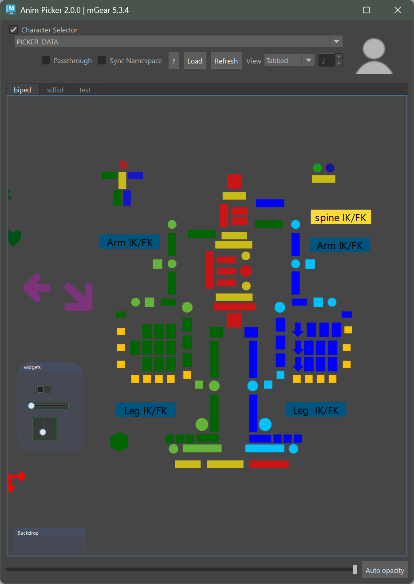

A picker is stored **per Maya scene** on a ``PICKER_DATAS`` node (as clean
JSON), and can also be exported to / imported from a ``.pkr`` file to reuse it
across scenes and characters.

Opening the Anim Picker
========================

From the mGear menu (**mGear ▸ Anim Picker**) you have three entries:

* **Anim Picker:** the floating animation window (the picker you pose with).
* **Anim Picker (Dockable):** the same animation window, dockable into Maya's
  UI as a workspace control.
* **Edit Anim Picker:** the editor, where you build and lay out the picker.

You can also open it from Python:

.. code-block:: python

    from mgear import anim_picker
    anim_picker.load()              # animation mode (floating)
    anim_picker.load(dockable=True) # animation mode (dockable)
    anim_picker.load(edit=True)     # edit mode

The Animation window
=====================

The top bar drives which picker is loaded and how it behaves:

* **Character Selector:** the collapsible header holds the picker-data combo
  box (which ``PICKER_DATAS`` node to show) and a snapshot picture of the
  character. Uncheck the group title to collapse it.
* **Passthrough:** turns this window into a click-through overlay (see
  `Opacity passthrough`_).
* **Sync Namespace:** when on, the picker resolves its controls in the
  namespace of your current selection, so one picker drives any referenced
  instance of the rig.
* **Load / Refresh:** load a picker from a ``.pkr`` file, or re-read the data
  node and re-sync the widgets to the rig.
* **View:** **Tabbed** shows one tab at a time; **Tiled** shows several tabs
  side by side (the spinbox sets the column count).
* **Tabs:** a picker can hold several pages (e.g. *body*, *face*); click a tab
  to switch.

**Selecting controls:** click an item to select its associated control(s).
Hold **Shift** to add to the selection, **Ctrl** to toggle, and drag on empty
canvas to marquee-select. Panning is **middle-mouse drag**, zooming is the
**mouse wheel**, and **F** frames the content.

At the bottom, the **opacity slider** fades the whole window, and **Auto
opacity** makes it fade automatically while the mouse is away and become opaque
on mouse-over — handy for keeping the picker on screen without hiding the
viewport.

Opacity passthrough
--------------------

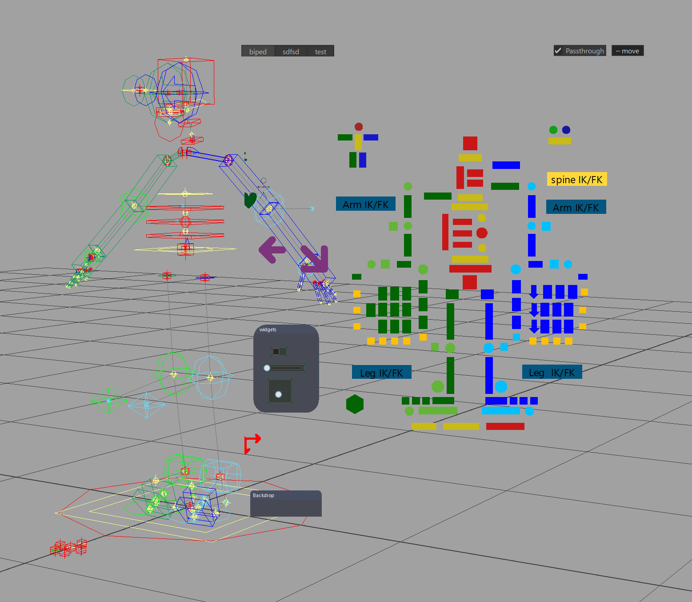

Passthrough turns the floating picker into a HUD you can click **straight
through**. Check the **Passthrough** box and, while the window is transparent
(opacity below 100%) with **Auto opacity off**, everything except the item
buttons and the tabs becomes see-through and **click-through** — clicking an
empty gap selects and manipulates the rig in the viewport behind, without
moving the picker aside. Each item is cut on its real shape, so vector buttons
follow their outline.

* Checking the box on a fully opaque window drops it to a transparent default
  so it engages in one click; unchecking restores the solid window (your last
  transparency is remembered).
* A small **"··· move"** grip and a second **Passthrough** checkbox appear at
  the top-right (the in-row checkbox is hidden while masked), so you can drag
  the window and switch passthrough off without leaving the mode.
* During a **pan or zoom the full window comes back** and moves smoothly, then
  re-masks the moment you stop.
* Passthrough is **per-window**: enabling it on one open picker does not affect
  the others. It applies to the floating window only.

Edit mode
=========

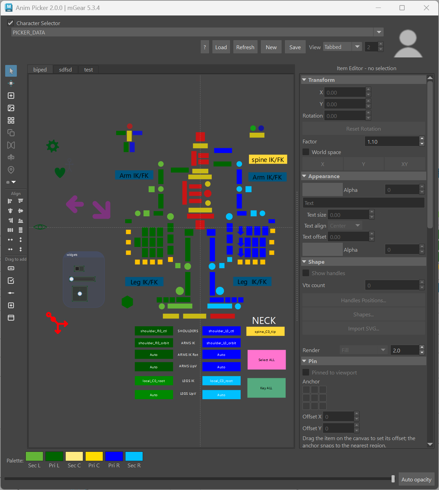

The editor adds a **left tool strip**, a **color palette** along the bottom,
and the **Item Editor** panel on the right. **New** creates a fresh picker on a
data node; **Save** writes the current picker to a ``.pkr`` file.

.. note::

    Every change in edit mode is recorded to an **undo / redo stack** (per
    tab). Use **Ctrl+Z** / **Ctrl+Shift+Z**, and the usual **Ctrl+C / V / X**
    (copy / paste / cut), **Ctrl+D** (duplicate), **Ctrl+Shift+D** (duplicate &
    mirror), **Delete**, **Ctrl+A** (select all), **arrow keys** to nudge
    (**Shift** for a larger step), **F** to frame and **Esc** to clear the
    selection. Shortcuts fire only while the picker has focus, so they never
    leak into Maya's global hotkeys.

The tool strip
--------------

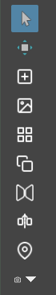

The top of the strip holds the canvas tools:

* **Select** and **Transform:** switch between selecting items and showing the
  move / scale / rotate manipulator to transform them on the canvas.
* **Add item:** drop a new default button on the canvas.
* **Import SVG:** load an ``.svg`` file as a vector-shape item (or drag one
  onto the canvas).
* **Shape library:** open the shape picker (see `Shapes`_).
* **Duplicate** and **Mirror:** copy the selection, or mirror it across the
  symmetry axis (with an optional name search / replace so the copies target
  the opposite-side controls).
* **Pin:** pin the selected items to a viewport corner as an on-screen HUD
  (see `Pin`_).
* **Trace from rig:** auto-generate a picker from the rig's control layout
  (see `Auto-build from the rig`_).

Auto-build from the rig
-----------------------

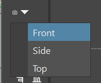

The camera drop-down at the bottom of the tool strip **builds a picker straight
from the rig**. It looks at the scene's controls from a **Front / Side / Top**
view and traces the **convex hull** of each control, creating a picker item per
control laid out to match the rig's spatial distribution — a fast way to get
the whole control layout in one step, which you then refine (shapes, colors,
grouping).

Aligning and distributing
-------------------------

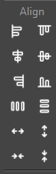

The **Align** section lines the selected items up (left / right / top / bottom
/ center, horizontally or vertically), distributes them evenly, and
**expands / contracts** their spacing a step at a time about the selection's
center — quick ways to tidy a row or column of buttons.

Drag to add — widgets & backdrops
---------------------------------

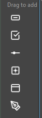

The **Drag to add** section lets you drag ready-made items onto the canvas:
interactive **widgets** (checkbox, slider, 2D slider), a plain **button**, a
**backdrop**, and a **vector item** (the **Vec** pen tile, see `Editing vector
(SVG) shapes`_). Drop one where you want it, then configure it in the Item
Editor.

Background layers
-----------------

.. image:: images/animpicker/background_layer.png
    :align: center
    :scale: 60%

Each tab can carry a **composite background** — an ordered stack of image
layers drawn **back-to-front** behind the items (a body chart, a face map, a
logo…). Backgrounds are **per tab**, so every page can have its own artwork.

Add a layer by right-clicking the canvas and choosing **Add background
layer**. To manage the stack, right-click the canvas and open **Background
layers...**:

* The **layer list** shows every layer on the current tab. **Add Layer** /
  **Remove Layer** add or drop one, and **Move Up** / **Move Down** reorder the
  stack — the top of the list is the **back-most** layer, so *Move Down* brings
  a layer forward and *Move Up* sends it back.
* **X / Y** position the selected layer and **Width / Height** size it, with
  **Maintain Aspect Ratio** to keep its proportions locked.
* While the dialog is open you can edit layers **directly on the canvas** too:
  click (or Shift-click / marquee) a layer to select it, then drag to move it
  or pull its handles to scale it.
* **Hover** a layer in the list to see its **resolved image path** as a tooltip,
  and **right-click** it for **Reveal in Folder** (opens the OS file browser
  with the image selected) and **Copy Resolved Path**.

**Remove all backgrounds** (canvas right-click) clears every layer at once.
There is no size cap on the artwork — the canvas grows to span the layers and
the buttons, so pan and zoom always reach all of it.

Capture a screen region as a background
+++++++++++++++++++++++++++++++++++++++

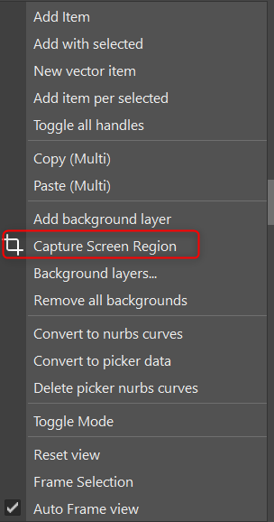

Instead of saving a screenshot in another tool first, you can capture any area
of the screen straight into a background layer. Right-click the canvas and
choose **Capture Screen Region**, or click **Capture Region** in the
**Background layers** dialog.

1. The picker window (and the Background layers dialog, if open) hides and the
   screen freezes, dimmed. This lets you capture the Maya viewport or anything
   else behind the picker.
2. **Drag** a rectangle over the area you want. The size in pixels is shown as
   you drag. Press **Esc** or **right-click** to cancel. A click without a drag
   is ignored, so you can just drag again.
3. A **save dialog** asks where to store the image (PNG by default, JPG also
   accepted). Cancel it to discard the capture.
4. The saved image is added as a new layer **in front of** the existing ones,
   and the picker windows come back.

The save dialog opens in the folder the picker loads relative images from,
next to the ``.pkr`` the picker was loaded from (or its
``ANIM_PICKER_RELATIVE_IMAGES`` sub-folder, see below), so the image travels
with the picker file. If the picker wasn't loaded from a ``.pkr``, it opens in
the folder you last saved a capture to in this session, or else in the Maya
project's ``images`` folder. The proposed file name is based on the tab name
(for example ``Body_bg.png``) and never overwrites an existing file.

Captures are taken at full resolution on high-DPI displays, and you can capture
on any monitor; a single selection stays within one monitor.

.. note::
    On **macOS**, Maya needs **Screen Recording** permission (System Settings >
    Privacy & Security). Without it the frozen screen shows only the desktop
    wallpaper.

Where background images are loaded from
+++++++++++++++++++++++++++++++++++++++

Each layer stores the **image path** it was added from, and that path is used
first. If the stored path no longer exists (for example the picker was moved to
another machine or shared with a team), the picker **falls back to searching
next to the ``.pkr`` file**: it looks for an image with the **same file name**
in the folder that holds the ``.pkr`` the picker was loaded from.

The relative folder searched is controlled by the ``ANIM_PICKER_RELATIVE_IMAGES``
environment variable, resolved **relative to the ``.pkr`` file**:

- Unset (the default) or ``""`` — look in the **same folder** as the ``.pkr``.
- ``"../images"`` — look in a sibling ``images`` folder next to the ``.pkr``.
- ``"../../images"`` — and so on for other layouts.

If neither the stored path nor the fallback resolves, the layer is skipped and a
warning is logged.

.. note::

    The fallback only applies when the picker was **loaded from a ``.pkr``
    file** (that load records the source file location). A picker that lives
    only on a scene node, with no external ``.pkr``, has no folder to search, so
    keep those image paths valid or re-point them.

Building items
==============

Shapes
------

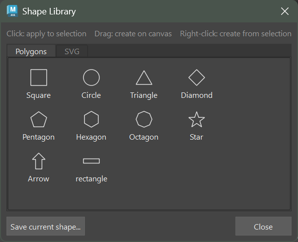

The **Shape Library** (tool strip, or the Item Editor's **Shapes...** button)
holds ready shapes across two tabs — **Polygons** (square, circle, triangle,
diamond, pentagon, hexagon, octagon, star, arrow, rectangle …) and **SVG**
(curved / organic icons like gear, heart, eye, hand). There are three ways to
use a tile:

* **Click** — apply that shape to the selected item(s).
* **Drag** — create a new item with that shape at the drop point.
* **Right-click** — **create from selection**: one item per selected Maya
  control, laid out in a row or column and each linked to (and colored from)
  its control.

**Save current shape...** stores the active item's shape (polygon or vector)
into your user library for reuse.

You can also build a shape from Maya curves: draw the outline as NURBS curves,
select them, and the picker traces them into an item's shape.

Editing vector (SVG) shapes
---------------------------

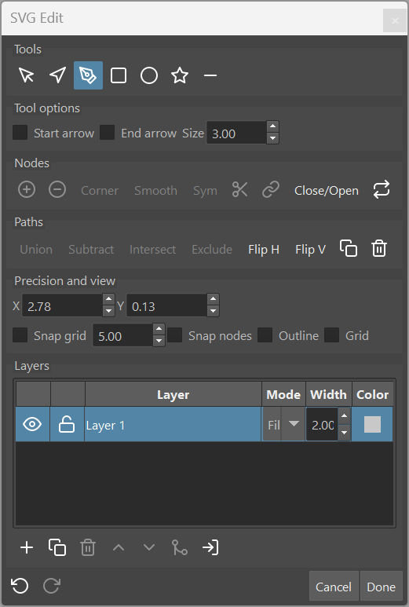

Vector items can be drawn and edited directly in the picker, without an
external editor.

**Starting and ending an edit.** In edit mode, right-click a vector item and
choose **Edit SVG**, or double-click it. The other items dim and a floating
**SVG Edit** toolbar opens beside the picker. Click **Done** (or press
**Enter**) to keep your changes; the whole edit is then a single picker undo
step. **Cancel** puts the item back exactly as it was. Switching tab, leaving
edit mode, or closing the toolbar counts as Done. **Esc** never cancels: it
finishes the path you are drawing, or clears the selection. Right-clicking the
canvas during an edit offers Done and Cancel.

**Creating a vector item.** Drag the **Vec** tile from the left toolbar's
**Drag to add** section onto the canvas (or double-click it to create at the
view center), or right-click empty canvas and choose **New vector item**: an
empty item is created and the Pen tool is ready.
If you click Done without drawing anything, the empty item is removed. To turn
an existing polygon button into an editable curve, right-click it and choose
**Convert to vector**.

**Tools** (shortcuts work while the canvas has focus):

* **Select (V)** picks whole shapes. Drag to move them; the box around the
  selection scales them (Shift keeps proportions) and its top circle rotates
  them (Shift snaps to 15°).
* **Node (A)** picks points. Click, Shift-click, or drag a marquee; drag to
  move; arrow keys nudge (Shift for a bigger step). Dragging a curve handle of
  a smooth point keeps it smooth. **Alt**-drag a handle to move it on its own
  (a sharp corner), Alt-drag a point with no handles to pull out new curve
  handles, and Alt-click a segment to add a point there.
* **Pen (P)**: click for a corner point, click-and-drag for a curved point,
  click the first point to close the shape. Enter, Esc, or a double-click
  finishes an open line. Shift keeps segments at 45° steps.
* **Rectangle (R)**, **Ellipse (E)**, **Polygon / Star (Y)**, and **Line
  (L)**. Drag to draw; Shift draws squares, circles, and 45° lines.

The mouse pointer changes with the tool: Select, Node, and Pen use their icon
(the click point is the tip), and the drawing tools show a crosshair with a
small badge of the shape.

**Tool options** under the tools change with the active tool:

* **Rectangle:** **Corner radius** for rounded corners.
* **Polygon / Star:** number of **Sides**, and a **Star** percentage (above 0
  makes a star with that inner radius).
* **Line** and **Pen:** **Start arrow** / **End arrow** and the arrow
  **Size**. An arrowhead is drawn as part of the line itself (one path), and
  follows the direction of the line at each end: on a **Fill** layer it is a
  solid triangle, on a **Stroke** layer an outlined head. Pen arrows apply to
  open paths only. In the Node tool the arrow's tip shows as two points on
  top of each other, because the path passes through the tip twice.
* Other tools show "No options for this tool".

.. note::
    A line (or an open Pen path) has no area, so on a **Fill** layer only its
    arrowheads show: draw lines on a **Stroke** layer.

**Node operations** act on the selected points: add a point between two
selected neighbours, delete points (also **Delete**), make points **Corner**
(no handles), **Smooth**, or **Sym** (smooth with equal handles), and reverse
the path's direction. Three of them open, close, or cut paths:

* **Break** cuts the path at the selected point. An open path becomes two
  paths that meet there; a closed shape becomes one open path that starts and
  ends at that point.
* **Join** connects two selected *end points*: the ends of two different open
  paths merge them into one path, and the two ends of the same path close it.
* **Close/Open** works on the whole path without picking points: it closes an
  open path with a segment from its last point back to its first, or opens a
  closed shape by removing that segment. Use **Break** to open a shape at a
  point of your choice.

**Path operations** act on the selected shapes: **Union**, **Subtract** (the
top-most selected shape is cut out of the others), **Intersect**, and
**Exclude**; **Flip H** / **Flip V**; duplicate; delete. Boolean results are
re-fitted into smooth curves, so they stay easy to edit.

**Precision and view.** The **X** / **Y** fields show and set the selected
point (or the centre of the selection). **Snap grid** (with a grid size) and
**Snap nodes** apply while you draw and drag. **Outline** shows every shape
as a thin wireframe, and **Grid** draws the snap grid; neither changes the
saved item.

**Layers.** An item can have several layers, drawn back to front (the top of
the list is in front). Each layer has its own visibility (eye), lock, **Fill**
or **Stroke** mode, stroke width, and **Color**. Use the buttons under the
list to add, duplicate, delete, reorder, and merge a layer into the one below,
and to move the selected shapes onto the highlighted layer. New drawings go
onto the highlighted layer. Double-click a name to rename it. Hidden and
locked layers can't be selected. Shapes only cut holes in each other when they
are on the same layer.

**Layer colors.** A layer uses the item's color until you give it its own:
click the layer's color swatch to pick one, and right-click it and choose
**Use item color** to go back. This makes two-tone icons possible in a single
item. The layer color sets the hue; the item's opacity still applies. Changing
the item's color later (Item Editor color, the palette, or mirror color)
resets every layer to the new item color, just as the Shape panel's stroke
width applies to every layer.

**Undo while editing.** Ctrl+Z / Ctrl+Shift+Z (or the toolbar arrows) step
through the edits of the current session without leaving it.

**Opacity.** New vector items are fully opaque by default (polygon buttons
start slightly transparent). An opacity you set yourself is kept when you
convert a polygon to a vector or apply an SVG shape to it.

**Exporting.** Right-click a vector item and choose **Export SVG...** to save
its visible layers as a standard ``.svg`` file. **Save current shape...** in
the Shape Library keeps the layers too.

.. note::
    Pickers saved with multi-layer vector items still open in older versions
    of the anim picker, which draw the shapes in a single fill or stroke style.

The Item Editor
===============

Selecting an item in edit mode fills the **Item Editor** panel on the right.
Its sections cover every property of the item; the most-used ones are open by
default.

Transform
---------

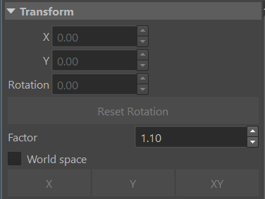

Position (**X / Y**) and **Rotation** of the item, a **Reset Rotation**
button, and a **Factor** with **X / Y / XY** buttons to scale the selection by
that factor (uniformly or on one axis). **World space** toggles whether the
transform is read in scene or local space.

Appearance
----------

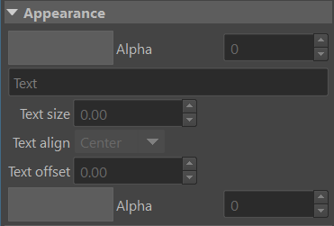

The item's **color** and **Alpha** (transparency), an optional **Text** label
with its **size**, **alignment** and **offset**, and the text's own color /
alpha. Text is stored display-independently so it looks right across monitors,
and scales on high-DPI screens.

Shape
-----

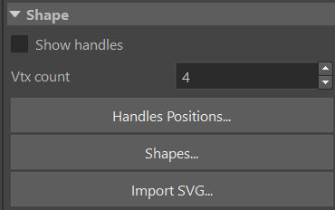

Controls for the item's outline: **Show handles** to edit the polygon points
on the canvas, the **Vtx count**, **Handles Positions...** for numeric point
entry, **Shapes...** to open the library, and **Import SVG...** to load a
vector shape from a ``.svg`` file. Vector items expose a **Render** mode
(**Fill** or **Stroke**) and a stroke width, applied to all of the item's
layers. Vector items have no polygon handles; edit their curves with **Edit
SVG** instead (see `Editing vector (SVG) shapes`_).

Controls
--------

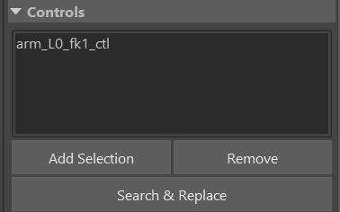

The Maya control(s) this item selects. **Add Selection** links the currently
selected controls, **Remove** unlinks the highlighted one, and **Search &
Replace** rewrites the names in bulk (e.g. ``_L0_`` → ``_R0_``) — the quick way
to retarget mirrored buttons.

Action
------

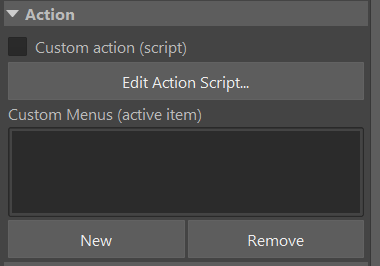

Give the item behaviour beyond selection. **Custom action (script)** runs a
Python script when the item is clicked (**Edit Action Script...**), and
**Custom Menus** add right-click menu entries with their own scripts.

Widgets
-------

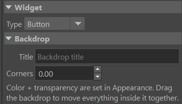

The **Type** drop-down turns a plain button into an **interactive widget** that
reads and drives a rig attribute directly in the picker:

* **Checkbox** — toggles a boolean attribute (or master-controls the
  visibility of an item **group**, see `Visibility`_).
* **Slider** — drags a single attribute between a min and max.
* **2D slider** — drives two attributes (X / Y) at once from one handle.

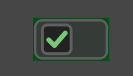

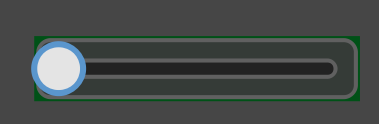

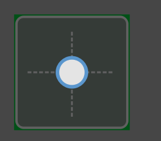

Each widget is bound to its attribute(s) and range in the editor, and stays in
sync with the rig on selection / time change.

Backdrop
--------

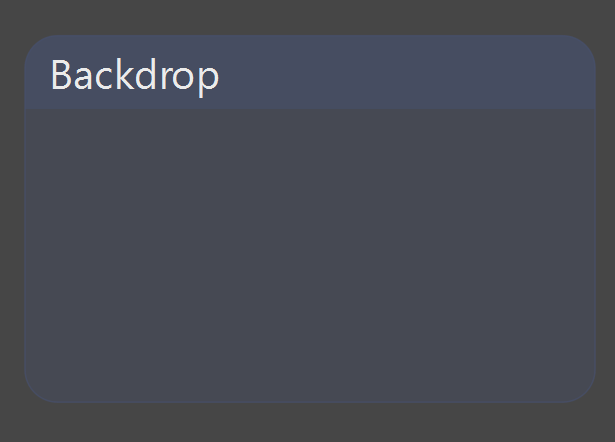

A **backdrop** is a titled panel drawn behind other items to group them
visually. Set its **Title** and **Corners** (rounding); its color and
transparency come from **Appearance**. Dragging the backdrop moves everything
sitting on top of it together.

Visibility
----------

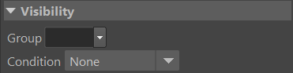

Show or hide the item conditionally:

* **Group** — tag the item into a named group. A **checkbox** widget set to
  *control* that group can then show / hide every item in it at once (with an
  optional invert), right in the picker and with no rig attribute required.
* **Condition** — show the item only by **zoom level** or by a **channel
  state** (e.g. an *IK* button visible only when the limb is in IK). Conditions
  and groups compose: a grouped item with its own condition is shown only when
  its group is shown **and** its condition passes.

Edit mode always shows every item, so conditional visibility never blocks
authoring.

Pin
---

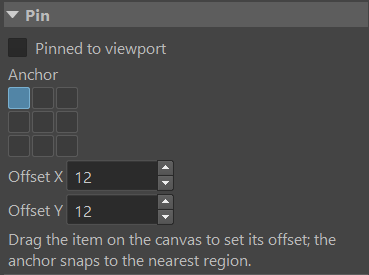

**Pinned to viewport** locks the item to a fixed spot on the canvas — it keeps
its screen position and size through pan and zoom, so it works as an on-screen
HUD button (a corner reset, a space switch, a settings button…). Pick the
**Anchor** cell (3×3) it sticks to and an **Offset**, or just drag the item on
the canvas to set the offset (the anchor snaps to the nearest region).

Mirror
------

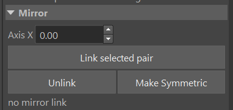

Link a left / right pair so edits propagate symmetrically. Set the **Axis X**
(the mirror line), **Link selected pair**, and thereafter moving or editing one
side updates its partner. **Make Symmetric** matches one side to the other, and
**Unlink** breaks the relationship.

Color palette
=============

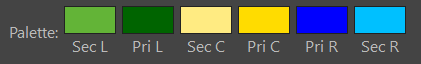

The palette along the bottom of the editor holds quick colors — secondary /
primary for **Left / Center / Right** — so you can color a selection with one
click and keep a consistent left/right convention across the board.

Saving and sharing pickers
==========================

A picker lives on a ``PICKER_DATAS`` node in the scene (stored as JSON), so it
travels with the file. Use **Save** to export the current picker to a ``.pkr``
file and **Load** to bring one in — the way to reuse a picker across scenes or
share it with a team.

.. note::

    **mGear 5.x note:** picker data is stored as clean JSON. A picker that
    lived **only** on a scene node in a much older version (with no ``.pkr``
    file) is auto-migrated and but should be saved once to make the updated
    data permanent.

Save options
------------

The **Save** window offers two destinations, and you can use either or both:

- **Save data to node** — writes the picker into the ``PICKER_DATAS`` node so it
  travels with the Maya scene.
- **Save data to file** — writes an external ``.pkr`` file. Use **Select File**
  to choose the path.

Portable file paths (``ANIM_PICKER_PATH``)
------------------------------------------

Set the ``ANIM_PICKER_PATH`` environment variable to a base folder to store
``.pkr`` paths **relative to that folder** instead of as absolute paths — handy
for sharing pickers across machines or between team members whose projects live
in different locations.

When ``ANIM_PICKER_PATH`` is set:

- The **Select File** dialog opens in that folder by default.
- When you pick a file **inside** that folder, the stored path replaces the base
  folder with the token ``[ANIM_PICKER_PATH]`` (for example
  ``[ANIM_PICKER_PATH]/characters/hero.pkr``).
- When the picker loads, the token is expanded back to the current value of
  ``ANIM_PICKER_PATH``, so the same file resolves correctly on any machine where
  the variable points at the equivalent folder.

If the variable is not set, or the file lives outside that folder, the full
absolute path is stored as usual.

Autosave
--------

The **Save** window also holds the autosave settings:

- **Enable autosave** — turns autosave on or off.
- **Interval (min)** — how often, in minutes, autosave checks your work.

These settings are remembered between sessions.

Autosave **never saves in the background**. Instead, when the interval elapses
and the picker has unsaved changes, it pops the same **Save** window with a clear
*"Autosave reminder"* message, so you stay in control of when and where the data
is written (node, file, or both). If there are no changes since the last save,
no reminder appears.

.. note::

    Autosave only prompts while the picker is in **edit mode**. It is skipped in
    animation mode and on referenced picker nodes, where saving is not allowed.

Prompt to save on close
-----------------------

If you close the picker window with unsaved changes, the same **Save** window
appears first so you don't lose work. Choose **Save** to save and close,
**Don't Save** to close without saving, or **Cancel** to keep the window open.
Closing with no unsaved changes does not prompt.