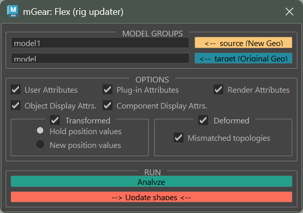

Flex User Documentation
#######################

Flex is a rig geometry updater that lets you replace the geometry of a rigged character with new or modified meshes while preserving all deformation, skinning, blendshapes, and attributes. It handles both matching and mismatched topologies, making it ideal for mid-production mesh updates without rebuilding the rig.

Access Flex from the menu: **mGear > Flex**

Overview
========

When a character model changes during production, re-rigging from scratch is expensive. Flex solves this by transferring all deformation data from the old rig geometry to the new geometry automatically.

Flex works by matching shapes by name between two groups:

- **Source group**: Contains the new or updated geometry
- **Target group**: Contains the original rigged geometry with deformers

For each matching shape pair, Flex can transfer:

- Blendshape targets
- Skin cluster weights
- Cluster weights
- User-defined attributes
- Display and render attributes
- Transform values
- UV set naming

.. note::

    Flex supports meshes, NURBS surfaces, and NURBS curves. Shape matching is based on the transform node name, so source and target shapes must share the same naming convention.

Workflow
========

1. Organize your new geometry under a single group node (the **source** group)
2. Identify the existing rigged geometry group (the **target** group)
3. Open **mGear > Flex** to launch the UI
4. Set the source and target groups using the arrow buttons or by typing the group names
5. Click **Analyze** to review shape matching and detect any issues
6. Configure the transfer options as needed
7. Click **Update shapes** to execute the transfer

After the update, the target group geometry will have the new shape with all the original deformation preserved.

Model Groups
============

The top section of the UI controls which groups Flex will operate on.

- **Source (New Geo)**: Click the orange arrow button to load the currently selected Maya node as the source group, or type the group name directly. This group should contain the updated geometry.
- **Target (Original Geo)**: Click the blue arrow button to load the currently selected Maya node as the target group, or type the group name directly. This group contains the rigged geometry you want to update.

Flex matches shapes between these two groups by transform node name. Any shapes in the source group that have a matching name in the target group will be processed.

Options
=======

Attributes
----------

Control which attributes are copied from the source shapes to the target shapes.

- **User Attributes**: Custom attributes added by the rigger or pipeline tools.
- **Plug-in Attributes**: Attributes defined by third-party plug-ins.
- **Render Attributes**: Rendering properties such as cast shadows, receive shadows, primary visibility, and smooth shading.
- **Object Display Attrs.**: Object-level display properties such as visibility, template, and LOD visibility.
- **Component Display Attrs.**: Component-level display settings such as display colors and material blending.

Transformation
--------------

- **Transformed**: When enabled, updates the transform node of the target to match the source.

  - **Hold position values**: Keeps the target transform in its current position (recommended for rigged meshes where the transform is driven by the rig).
  - **New position values**: Replaces the target transform values with those from the source.

Deformation
-----------

- **Deformed**: When enabled, transfers all deformation data (blendshapes, skin clusters, clusters) from the target to the new source geometry.
- **Mismatched topologies**: When enabled, Flex will handle shapes where the source and target have different vertex counts by using a wrap-based transfer method. When disabled, only shapes with identical topology will be processed.

.. note::

    The mismatched topology transfer uses a temporary wrap deformer to project deformation from the old topology to the new one. This works well for most cases but results may need manual cleanup in areas with significant topology changes.

Analyze
=======

Before running the update, use the **Analyze** button to preview the shape matching results. This opens the Analyze dialog showing a side-by-side comparison of source and target shapes.

The analysis checks three properties for each shape pair:

- **Type**: Whether source and target are the same shape type (mesh, NURBS surface, NURBS curve)
- **Count**: Whether the vertex/CV counts match
- **Bounding Box**: Whether the bounding boxes are similar in size

Each check displays a colored indicator:

- **Green**: Match
- **Red**: Mismatch
- **Yellow**: Warning (partial match)

Use this information to identify potential issues before running the update. Shapes with type mismatches will be skipped. Shapes with vertex count mismatches will use the wrap-based transfer if **Mismatched topologies** is enabled.

.. tip::

    Click on any row in the analyze table to select the corresponding shapes in the Maya viewport for visual inspection.

Update Shapes
=============

Click **Update shapes** to execute the transfer. Flex processes each matching shape pair through the following pipeline:

1. **Shape update**: Replaces the target geometry with the source geometry
2. **Deformer transfer**: Recreates blendshapes, copies skin weights, and transfers cluster weights onto the new geometry
3. **Attribute copy**: Copies selected attributes from source to target
4. **Transform update**: Updates transform values based on the selected mode

After completion, Flex reports any shapes that were found in the source but had no match in the target.

.. warning::

    The update operation modifies the target group geometry in place. It is recommended to save your scene before running Flex, especially on complex rigs.

Mismatched Topology Transfer
=============================

When the source and target shapes have different vertex counts, Flex uses a wrap-based approach to transfer deformation:

1. A temporary duplicate of the source shape is created
2. A wrap deformer binds the duplicate to the target shape
3. Blendshape targets are transferred through the wrap, projecting them onto the new topology
4. Skin cluster weights are copied using closest-joint association
5. Cluster weights are exported and re-imported onto the new geometry
6. All temporary nodes are cleaned up

This allows Flex to handle production scenarios where the model has been retopologized or had geometry added or removed.

Supported Deformers
===================

Flex fully transfers the following deformer types:

- **Blendshapes**: All targets including in-between shapes and their weight values
- **Skin Clusters**: Joint weights with influence association by name and closest joint
- **Clusters**: Deformer weights via Maya's deformerWeights export/import

Other deformer types present on the target geometry are not automatically transferred and may need to be recreated manually after the update.