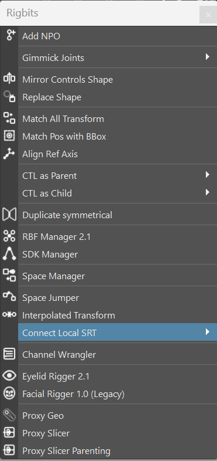
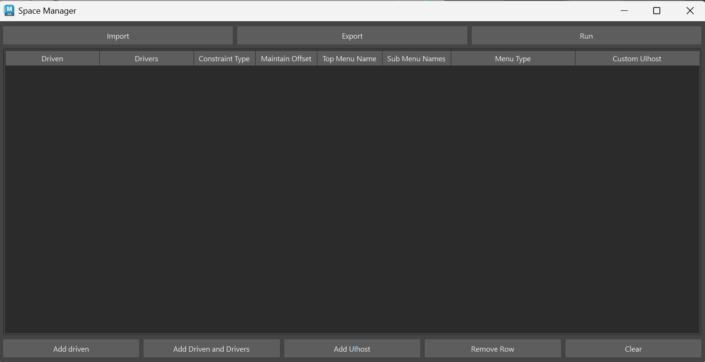
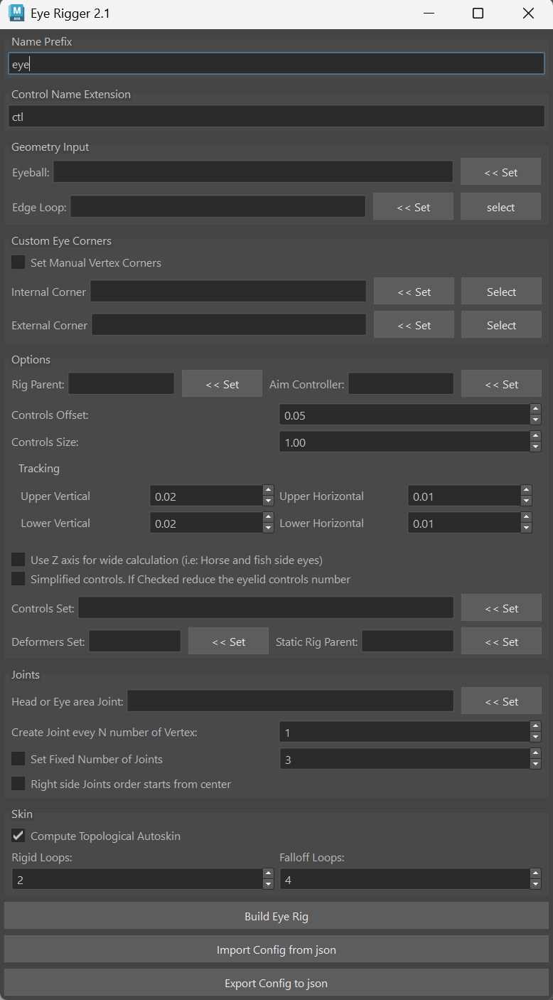
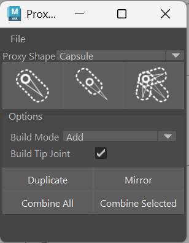
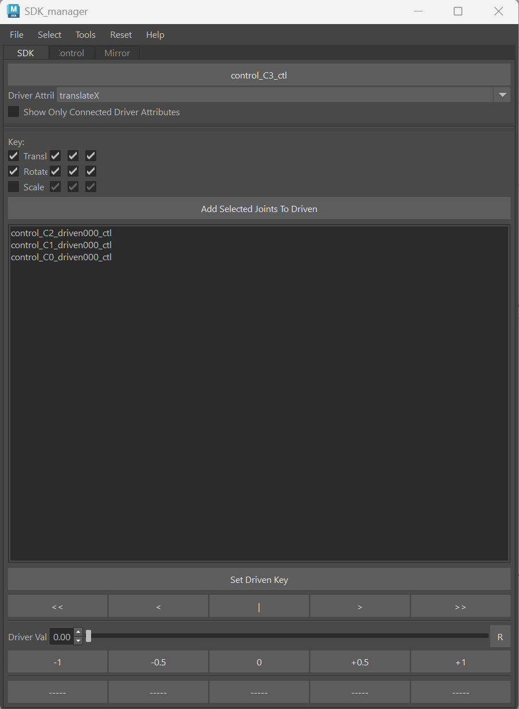
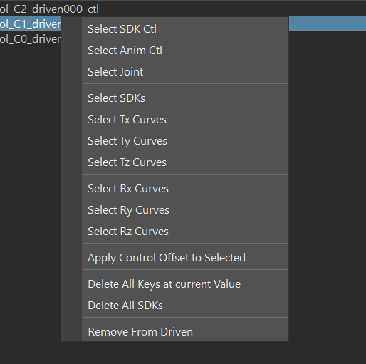
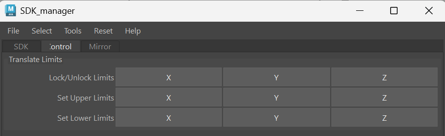
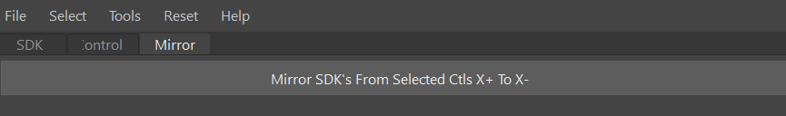
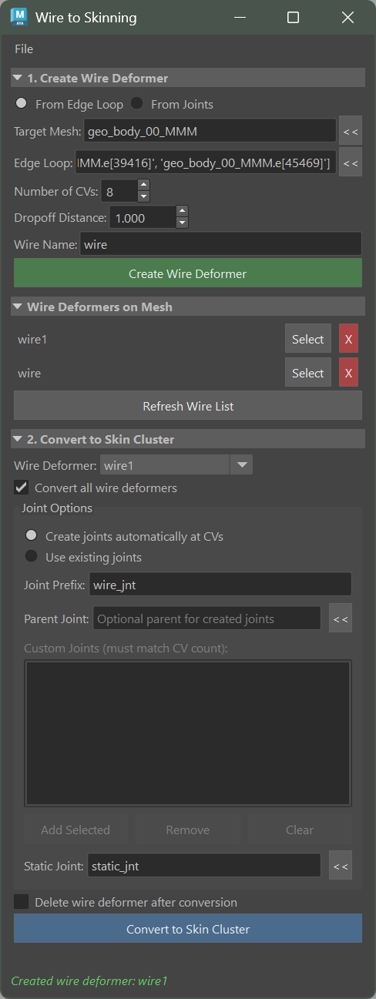

Rigbits User Documentation
###########################

Rigging tools

Add NPO
===========

Add a transform as parent of each selected object in order to neutralize the local values to the reset position

.. figure:: images/rigbits/npo_before.png
    :align: center
    :scale: 95%

    The tranlate X and Y have some values

.. figure:: images/rigbits/npo_after.png
    :align: center
    :scale: 95%

    All the local transform values are reset

Gimmick Joints
==============

Joint helper tools.

Add Joint
---------------------

Add a deformer joint to each selected object.

This command will try to add the joint to "rig_deformers_grp" or create it if doesn't exist.
Also will parent the joint under "jnt_org" if exist. If doesn't exist will parent the joint under the corresponding object.

Add Blended Joint
---------------------

Add a blended joint under a chain of joints. This joint will rotat 50% between 2 joints.

.. image:: images/rigbits/gimmick_joints.png
    :align: center
    :scale: 95%

Add Support Joint
---------------------

Support joint are created under a blended joint and are design to help with deformation. Typically this kind of joints will also be driven by a SDK or similar.

Replace Shape
==============

Replace the shape of one object shape with another

.. image:: images/rigbits/gif/replace_shape.gif
    :align: center
    :scale: 95%

Match All Transform
===================

Align one object to another object using the world Matrix reference.

Match Pos with BBox
===================

Center the position of an object in the center of the bounding box of an object.

Align Ref Axis
==============

Create a reference locator axis based on a point selection. This command needs at less 3 points.

.. image:: images/rigbits/gif/Align_ref_axis.gif
    :align: center
    :scale: 95%

.. Tip::

	Very useful to find rotation axis in mechanical rigs if the transformations of the mesh have been freeze.

CTL as Parent
==============

Create a control of the selected shape as parent of each selected object.

Ctl as Child
==============

Create a control of the selected shape as child of each selected object.

Duplicate Symmetrical
======================

Duplicate and mirror the selected object and his children. This is done by negating some axis scaling and inverting some of the values. This will provide a mirror behavior.
Also handle some renaming. i.e: from _L to _R

RBF Manager
===========

A tool to manage a number of RBF type nodes under a user defined setup(name)

**2.1 quick overview**

.. only:: html

   .. raw:: html

      

        

          <iframe
              title="vimeo-player"
              src="https://player.vimeo.com/video/1115410441?h=cbaa109360"
              frameborder="0"
              allow="autoplay; fullscreen; picture-in-picture; clipboard-write;
                      encrypted-media; web-share"
              allowfullscreen
              style="position: absolute; top: 0; left: 0; width: 100%;
                     height: 100%;">
          </iframe>
        

      

.. only:: not html

   `Watch on Vimeo <https://vimeo.com/1115410441/cbaa109360?fl=pl&fe=sh>`_

**RBF Manager Tutorial**

.. only:: html

   .. raw:: html

      

        

          <iframe
              title="vimeo-player"
              src="https://player.vimeo.com/video/1115410469?h=aae34545a5"
              frameborder="0"
              allow="autoplay; fullscreen; picture-in-picture; clipboard-write;
                      encrypted-media; web-share"
              allowfullscreen
              style="position: absolute; top: 0; left: 0; width: 100%;
                     height: 100%;">
          </iframe>
        

      

.. only:: not html

   `Watch on Vimeo <https://vimeo.com/1115410469/aae34545a5>`_

Steps -
    set Driver
    set Control for driver(optional, recommended)
    select attributes to driver RBF nodes
    Select Node to be driven in scene(Animation control, transform)
    Name newly created setup
    select attributes to be driven by the setup
    add any additional driven nodes
    position driver(via the control)
    position the driven node(s)
    select add pose

Add notes -
Please ensure the driver node is NOT in the same position more than once. This
will cause the RBFNode to fail while calculating. This can be fixed by deleting
any two poses with the same input values.

Edit Notes -
Edit a pose by selecting "pose #" in the table. (which recalls recorded pose)
reposition any controls involved in the setup
select "Edit Pose"

Delete notes -
select desired "pose #"
select "Delete Pose"

Mirror notes -
setups/Controls will succefully mirror if they have had their inverseAttrs
configured previously.

Space Manager
=============

Create and manage space switches for rig controls. Space switches allow controls to follow different parent spaces (world, local, custom targets).

**Constraint Types:**

* **Parent** - Full transform constraint (position, rotation, scale)
* **Point** - Position only constraint
* **Orient** - Rotation only constraint
* **Scale** - Scale only constraint

**Menu Types:**

* **Enumerated** - Dropdown attribute for discrete space selection
* **Float** - Blend attribute for smooth space interpolation

**Workflow:**

1. Select the control that needs space switching
2. Add target spaces (objects to follow)
3. Choose constraint type and menu type
4. Create the space switch

**Import/Export:**

Space configurations can be saved and loaded as .smd files for reuse across rigs.

Space Jumper
============

Create a local reference space from another space in the hierarchy. This creates a non-cyclic space relationship using matrix math.

**Usage:**

1. Select the reference space (parent transform)
2. Select the jump space (child space to reference)
3. Run Space Jumper

The tool creates ``_SPACE_`` and ``_JUMP_`` transforms connected via ``gear_mulmatrix_op`` for clean space relationships.

Interpolate Transform
=====================

Create a transform that blends between two objects using matrix interpolation.

.. image:: images/rigbits/interpolated_transform.png
    :align: center
    :scale: 80%

**Usage:**

1. Select the first object (A)
2. Select the second object (B)
3. Run Interpolate Transform

Creates a new transform with ``_INTER_`` naming that interpolates 50% between both objects. Uses ``gear_intmatrix_op`` for smooth matrix-based blending.

Connect Local SRT
=================

Connect Scale, Rotation, and/or Translation attributes between objects.

.. image:: images/rigbits/connect_local_SRT_menu.png
    :align: center
    :scale: 80%

**Options:**

* **Connect SRT** - Connect all three (Scale, Rotation, Translation)
* **Connect S** - Scale only
* **Connect R** - Rotation only
* **Connect T** - Translation only

**Usage:**

1. Select the source object (first)
2. Select target objects
3. Choose which attributes to connect

Channel Wrangler
================

Move or proxy channels between nodes with a visual table interface.

.. image:: images/rigbits/channel_wrangler.png
    :align: center
    :scale: 80%

**Operation Modes:**

* **Move Channel** - Physically move the channel from source to target
* **Proxy Channel** - Create a proxy attribute that mirrors the source

**Move Policies:**

* **merge** - Merge with existing channels
* **index** - Match by channel index
* **fullName** - Match by full attribute name

**Proxy Policies:**

* **index** - Match by channel index
* **fullName** - Match by full attribute name

**UI Features:**

* Visual table with Index, Channel, Source, Target, Operation columns
* Channel and Target line edits with picker buttons
* Set Multi-Channel and Set Multi-Target for batch operations
* Import/Export configurations as .cwc JSON files

Eye Rigger
==========

Automatic eyelid rigging tools. Two versions are available:

Eye Rigger 2.1
--------------

The updated eye rigger with simplified options and improved workflow.

**Key Features:**

* Automatic upper/lower eyelid rigging from edge loops
* Multiple joint distribution options (every N vertex, fixed count, from center)
* Simplified mode for lighter rigs
* Customizable control size
* Auto-skin with topological propagation
* Vertical/Horizontal tracking attributes
* Blink height offset parameter

**Workflow:**

1. Select the eye mesh
2. Pick the eyelid edge loop
3. Set corner vertices (automatic or manual)
4. Configure joint distribution settings
5. Set naming prefix
6. Build the rig

**Parameters:**

* **Edge Loop** - The eyelid edge loop to rig
* **Corner Vertices** - Inner and outer corner vertex selection
* **Prefix** - Naming prefix for created nodes
* **Offset** - Surface offset distance (default 0.05)
* **Rigid/Falloff Loops** - Control density settings
* **Head Joint** - Reference joint for parenting
* **Do Skin** - Enable automatic skinning
* **Simplified** - Create simplified rig version

Eye Rigger (Legacy)
-------------------

The original eye rigger for backward compatibility.

.. image:: images/rigbits/eye_rigger.png
    :align: center
    :scale: 80%

Similar functionality to version 2.1 with the original parameter set including blink height percentage control.

Lips Rigger
===========

Automatic lip rigging from edge loops.

.. image:: images/rigbits/lips_rigger.png
    :align: center
    :scale: 80%

**Key Features:**

* Lip edge loop setup for upper and lower lips
* Central vertex selection for proper topology handling
* Thickness parameter for offset control
* Rigidity and falloff density settings
* Head and jaw joint references
* Automatic shape and control creation

**Workflow:**

1. Select the lip edge loop
2. Set the upper central vertex
3. Set the lower central vertex
4. Configure thickness and density settings
5. Set head and jaw joint references
6. Build the rig

**Parameters:**

* **Edge Loop** - The lip edge loop
* **Up Vertex** - Upper central vertex
* **Low Vertex** - Lower central vertex
* **Thickness** - Offset amount (default 0.3)
* **Rigid Loops** - Rigidity density (default 5)
* **Falloff Loops** - Falloff density (default 8)
* **Head Joint** - Head reference joint
* **Jaw Joint** - Jaw reference joint

Proxy Geo
=========

Create proxy geometry for joints with multiple creation modes.

**Creation Modes:**

* **Proxy to Next** - Extends geometry toward the next joint in chain
* **Proxy Centered** - Creates geometry centered at joint position
* **Proxy to Children** - Aims geometry at child joints

**Shape Types:**

* **Capsule** - Rounded cylinder shape
* **Box** - Rectangular box shape

**Build Modes:**

* **Add** - Add new proxy geometry
* **Replace** - Replace existing proxy geometry

**Features:**

* Duplicate and Mirror existing proxies
* Combine multiple proxies into single mesh
* Export/Import proxy configurations as .pxy files
* Automatic axis alignment
* Build Tip Joint option for end joints

**Proxy Attributes:**

Created proxies have custom attributes for identification and configuration:

* ``isProxy`` - Boolean marker
* ``proxy_shape`` - "capsule" or "box"
* ``proxy_axis`` - Axis alignment
* ``side`` / ``length`` - Dimension attributes

Proxy Slicer
============

Create proxy geometry by analyzing skin cluster weights and splitting the mesh per joint influence.

**How it works:**

1. Analyzes the skinCluster influence weights per face
2. Groups faces by their dominant joint influence
3. Creates separate proxy meshes per joint
4. Names proxies as ``JointName_Proxy``

**Usage:**

Select a skinned mesh and run Proxy Slicer. The system automatically creates proxy geometry based on skin weights, with each proxy representing the area most influenced by that joint.

Proxy Slicer Parenting
======================

Same as Proxy Slicer but parents the created proxies directly under their influence joints instead of grouping them separately.

**Difference from Proxy Slicer:**

* **Proxy Slicer** - Creates a ProxyGeo group with matrix connections
* **Proxy Slicer Parenting** - Parents proxies directly under influence joints

SDK Manager
===========

The SDK Manager is a tool for creating and managing Set Driven Keys (SDKs) in mGear rigs. It provides a streamlined workflow for setting up SDK-based facial rigs and corrective shapes using joints.

Overview
--------

The SDK Manager workflow is based on Judd Simantov's facial rigging techniques, using joints and SDKs to create facial shapes with the control of joints and weighting rather than blendshapes.

**Advantages:**

* Same results as blendshape-based face rigs with extreme control over every shape
* Expose tweak controls for every joint to animators
* Fits into the rebuild workflow - pivots and controllers can be altered without destroying rig work
* Export/import weight maps, guides, and SDKs between characters
* Can add blendshapes on top for further deformation

SDK Tab
-------

The main SDK tab provides the core functionality for setting driven keys.

**Driver Section:**

* Click the **Driver** button with a control selected to set it as the driver
* Choose the **Driver Attribute** from the dropdown to select which attribute drives the SDKs
* Enable **Show Only Connected Driver Attributes** to filter the dropdown to attributes that already have SDKs

**Key Channels:**

Select which channels to key on the driven controls:

* **Translate** - with individual X, Y, Z checkboxes
* **Rotate** - with individual X, Y, Z checkboxes
* **Scale** - with individual X, Y, Z checkboxes

This allows you to key only specific axes (e.g., only Translate Y and Rotate Z) rather than all channels.

**Driven Section:**

* Click **Add Selected Joints To Driven** to add SDK controls to the driven list
* Select items in the list and click **Set Driven Key** to create SDKs at current values
* Use the navigation buttons (<<, <, |, >, >>) to jump between existing key values
* Use the **Driver Val** slider and spin box to scrub the driver value
* The -1, -0.5, 0, +0.5, +1 buttons provide quick value adjustments

**Save Slots:**

The five save slot buttons allow you to store and recall SDK control positions:

* Click with controls selected to save their current values
* Click again to restore saved values
* Ctrl+Click to clear the slot

Right-Click Menu
----------------

Right-click on items in the driven list for additional options:

* **Select SDK Ctl** - Select the SDK control in the viewport
* **Select Anim Ctl** - Select the animation tweak control
* **Select Joint** - Select the driven joint
* **Select SDKs** - Select all SDK animation curves
* **Select Tx/Ty/Tz/Rx/Ry/Rz Curves** - Select specific channel curves
* **Apply Control Offset to Selected** - Match driven controls to driver position
* **Delete All Keys at current Value** - Remove keys at the current driver value
* **Delete All SDKs** - Remove all SDKs from selected items
* **Remove From Driven** - Remove items from the driven list

Controls Tab
------------

The Controls tab provides tools for setting transform limits on SDK controls.

* **Lock/Unlock Limits** - Toggle transform limits on X, Y, Z axes
* **Set Upper Limits** - Set upper limit from current position
* **Set Lower Limits** - Set lower limit from current position

Mirror Tab
----------

The Mirror tab allows mirroring SDKs between left and right controls.

* Select driver controls and click **Mirror SDK's From Selected Ctls X+ To X-** to copy SDKs to the opposite side

Menu Bar
--------

**File Menu:**

* **Export SDK's** - Export all SDKs to a JSON file
* **Import SDK's** - Import SDKs from a JSON file

**Select Menu:**

* **Select All SDK Ctls** - Select all SDK controls in the scene
* **Select All Anim Ctls** - Select all animation tweak controls
* **Select All SDK Jnts** - Select all SDK-driven joints
* **Select All SDK Nodes** - Select all SDK animation curve nodes

**Tools Menu:**

* **Toggle Infinity** - Toggle pre/post infinity on SDK curves
* **Set Tangent Type** - Set in/out tangent types (Auto, Spline, Flat, Linear, Plateau, Stepped)
* **Auto Set/Remove Limits** - Batch limit operations on selected controls
* **Rescale Driver range to fit Driven** - Adjust driver range
* **Lock/Unlock Animation/SDK Ctls** - Lock or unlock control channels
* **Prune SDKs with no input/output** - Clean up orphaned SDK nodes

**Reset Menu:**

* **Reset All Ctls** - Reset all controls to default
* **Reset SDK Ctls** - Reset only SDK controls
* **Reset Anim Tweaks** - Reset only animation tweak controls

Wire to Skinning
================

A tool for creating wire deformers and converting them to skin clusters using the de Boor algorithm for NURBS-based weight computation.

Overview
--------

Wire to Skinning provides a workflow for:

1. **Creating wire deformers** from edge loops or joints
2. **Converting wire deformers to skin clusters** with precise B-spline weight distribution
3. **Export/Import configurations** for reusable wire setups

This tool is particularly useful for facial rigging, secondary deformation, and any setup requiring smooth, NURBS-based weight falloff.

.. Tip::

    Wire deformers are excellent for quick deformation tests. Use this tool to convert your wire setup to production-ready skin clusters once you're happy with the result.

Create Wire Section
-------------------

The top section allows creating wire deformers using two methods:

**Edge Loop Mode:**

* Select edges from the mesh to define the wire curve path
* Specify the number of CVs for the curve (more CVs = more joints/control)
* The curve is rebuilt to match the target CV count

**Joint Mode:**

* Select existing joints to define the wire curve
* The curve CVs are connected to joints via ``mgear_curveCns`` deformer
* Moving joints automatically updates the wire curve
* Joint ordering options: Selection order, Hierarchy, or Position X

**Common Parameters:**

* **Mesh** - Target mesh for the wire deformer
* **Wire Name** - Base name for the created wire deformer
* **Dropoff** - Wire influence falloff distance

Existing Wires Section
----------------------

Displays all wire deformers currently affecting the selected mesh.

* **Refresh** - Update the wire list
* **Select** - Select the wire deformer in Maya
* **Remove** - Delete the wire deformer and its curves

Convert to Skin Section
-----------------------

Converts wire deformers to skin clusters using the de Boor algorithm for B-spline basis function evaluation.

**Wire Selection:**

* **All Wires** - Convert all wire deformers on the mesh
* **Selected Wire** - Convert only the selected wire from the dropdown

**Joint Options:**

* **Auto-create joints** - Create joints at each curve CV position

  * **Prefix** - Naming prefix for auto-created joints
  * **Parent Joint** - Optional parent for the joint chain

* **Custom joints** - Use manually specified joints (must match CV count)

**Conversion Parameters:**

* **Static Joint** - Joint for vertices outside wire influence (default: ``static_jnt``)
* **Delete Wire** - Remove the wire deformer after conversion

**How Conversion Works:**

1. For each vertex, finds the closest point on the wire curve
2. Computes B-spline basis functions at that parameter using de Boor's algorithm
3. Distributes weights across nearby joints based on curve continuity
4. Blends with existing skin weights or assigns to static joint for unaffected areas

.. Tip::

    When converting a wire created from joints, the tool automatically uses those connected joints for skinning - no need to manually specify them.

Configuration Export/Import
---------------------------

Save and load wire configurations for reuse across scenes or characters.

**File Menu:**

* **Export Configuration** - Save wire setup to a ``.wts`` file
* **Import Configuration** - Load wire setup from a ``.wts`` file

**Exported Data:**

* Wire deformer settings (dropoff, scale, envelope)
* Curve CV positions
* Connected joint names (for joint-mode wires)
* Conversion settings

**Import Behavior:**

* Recreates wire deformers from saved curve data
* For joint-connected wires, automatically reconnects to existing joints
* Falls back to static curves if referenced joints don't exist

.. Tip::

    Enable mGear file drop (mGear > Utilities > Enable mGear file drop) to import ``.wts`` files by dragging them into Maya's viewport.

Scripting Access
----------------

The tool's core functions are available for scripting:

.. code-block:: python

    from mgear.rigbits import wire_to_skinning

    # Show the UI
    wire_to_skinning.show()

    # Create wire from edges
    positions = wire_to_skinning.get_edges_positions(edges)
    curve = wire_to_skinning.create_curve_from_positions(positions, num_cvs=8)
    wire = wire_to_skinning.create_wire_deformer(mesh, curve, dropoff_distance=5.0)

    # Create wire from joints
    wire, curve, curvecns = wire_to_skinning.create_wire_from_joints(
        mesh, joints, dropoff_distance=5.0, name="lip_wire"
    )

    # Convert wire to skin
    curve_info = wire_to_skinning.get_curve_info(curve)
    wire_info = wire_to_skinning.get_wire_deformer_info(wire)
    weights, uses_static = wire_to_skinning.compute_skin_weights_deboor(
        mesh, curve_info, wire_info, wire_deformer=wire
    )
    joints = wire_to_skinning.create_joints_at_cvs(curve_info, prefix="lip")
    skin = wire_to_skinning.create_skin_cluster(mesh, joints, weights)

    # Export/Import configuration
    wire_to_skinning.export_configuration(mesh, "/path/to/config.wts")
    wire_to_skinning.import_configuration("/path/to/config.wts", target_mesh=mesh)

**Core Module Functions:**

The underlying functions are also available in ``mgear.core`` modules:

* ``mgear.core.curve.getCurveInfo()`` - Get curve CVs, degree, knots
* ``mgear.core.deformer.createWireDeformer()`` - Create wire deformer
* ``mgear.core.deformer.getWireDeformerInfo()`` - Get wire deformer attributes
* ``mgear.core.deformer.getWireWeightMap()`` - Get per-vertex wire weights
* ``mgear.core.deformer.getMeshWireDeformers()`` - Find wire deformers on mesh
* ``mgear.core.skin.getCompleteWeights()`` - Get skin weights by vertex
