Shifter User Documentation
##########################

Please visit:
`mGear Youtube channel <https://www.youtube.com/c/mgearriggingframework/>`_

.. _shifter-guide-manager:

Shifter Guide Manager
==============================================

The Shifter Guide Manager is the central hub for building rigs with mGear's Shifter system. It provides tools for browsing and adding components, exploring guide hierarchies, and managing templates.

Access the Guide Manager from the menu: **mGear > Shifter > Guide Manager**

The Guide Manager consists of three main tabs:

- **Components List**: Browse, search, and add components to your guide
- **Guide Explorer**: Navigate and manage your guide hierarchy
- **Templates**: Save, load, and compare guide templates

.. _components-list:

Components List
----------------

The Components List tab allows you to browse all available Shifter components, view their information, and add them to your guide.

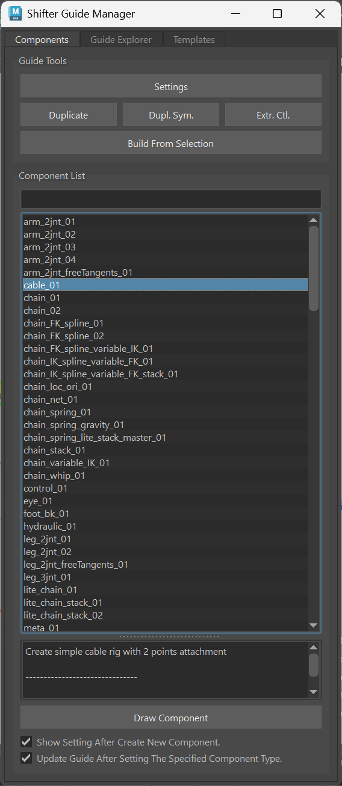

Tools
++++++++++++++++++

**Settings**

Opens the Component/Guide root settings window for the currently selected component or guide root.

**Duplicate**

Duplicates the selected component, creating an identical copy with an incremented index.

**Duplicate Symmetry**

Creates a symmetrical duplicate of the selected component on the opposite side (e.g., L to R or R to L).

**Extract Controls**

Extracts selected controls and stores them as a control buffer for later use.

**Build From Selection**

Builds the rig from the currently selected guide or components.

Component Browser
++++++++++++++++++

**Search Bar**

Filter the component list in real-time as you type. The search supports wildcard matching with ``*`` and ``?`` characters.

- Right-click the search bar to access the "Clear" option

**Component List**

Displays all available Shifter components in an alphabetically sorted list.

- **Single-click**: Select a component and display its information
- **Double-click**: Draw the selected component to the scene
- **Drag and drop**: Drag a component from the list to the scene to draw it with automatic parent assignment

**Component Information Panel**

When a component is selected, displays detailed information including:

- Component description
- Author name
- URL link (if available)
- Version number
- Component type
- Component name

**Draw Component Button**

Draws the selected component to the scene. If an object is selected in the scene, it will be used as the parent for the new component.

Options
++++++++++++++++++

**Show Setting After Create New Component**

When enabled, automatically opens the component settings dialog after creating a new component.

**Update Guide After Setting The Specified Component Type**

When enabled, automatically updates the guide after changing a component's type.

Context Menu
++++++++++++++++++

Right-click on the component list to access:

- **Sync The Selected Component Type To The Type Selected In The Manager**: Synchronizes the scene component's type with the manager selection
- **Draw Component**: Draws the selected component to the scene
- **Refresh List**: Reloads the component list from disk

.. _guide-explorer:

Guide Explorer
---------------

The Guide Explorer provides a hierarchical view of your guide structure, allowing you to navigate, select, and manage components efficiently.

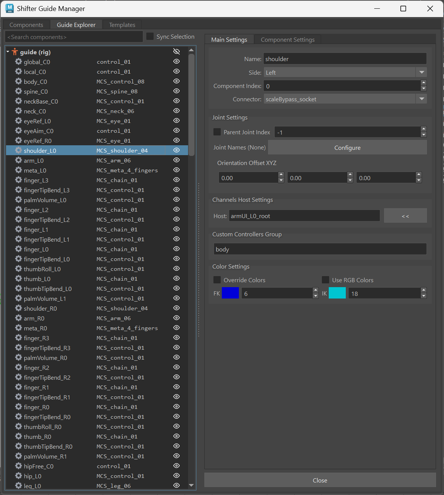

Search and Options
++++++++++++++++++

**Search Bar**

Filter components by name and type using space-separated search terms. All terms must match for a component to be displayed.

**Sync Selection**

When enabled, provides bidirectional selection synchronization between the scene and the tree view:

- Selecting in the tree updates the Maya selection
- Selecting in Maya updates the tree selection

Component Tree
++++++++++++++++++

The tree view displays your guide hierarchy with three columns:

- **Visibility Toggle**: Click the eye icon to toggle component visibility
- **Component Name**: Shows the full component name (e.g., "arm_L0")
- **Component Type**: Displays the component type in monospace font

The root item shows the guide name with a character icon, while child components display with a gear icon.

Settings Panel
++++++++++++++++++

The right panel dynamically displays settings for the selected item:

- **Guide Root Selected**: Shows guide-level settings
- **Component Selected**: Shows component-specific settings
- **Nothing Selected**: Shows a placeholder message

Context Menu
++++++++++++++++++

Right-click on items in the tree to access:

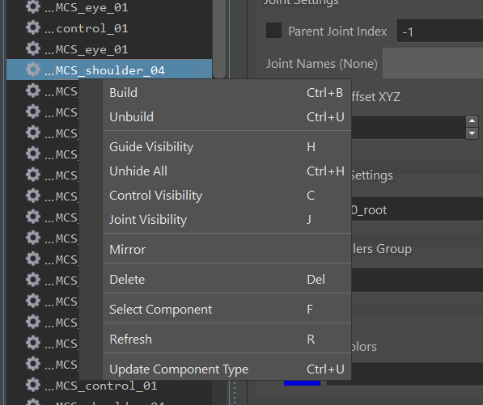

- **Build**: Build rig from selection (Ctrl+B)
- **Unbuild**: Delete the built rig (Ctrl+U)
- **Guide Visibility**: Toggle guide visibility (H)
- **Unhide All**: Show all hidden guides (Ctrl+H)
- **Control Visibility**: Toggle rig control visibility (C)
- **Joint Visibility**: Toggle rig joint visibility (J)
- **Mirror**: Mirror the selected component
- **Delete**: Delete the selected component (Del)
- **Select Component**: Select the component in the scene (F)
- **Refresh**: Refresh the tree from the scene (R)
- **Update Component Type**: Change the component type

Keyboard Shortcuts
++++++++++++++++++

- **R**: Refresh tree from scene
- **Ctrl+B**: Build rig
- **Ctrl+U**: Unbuild rig
- **Del**: Delete selected component
- **H**: Toggle guide visibility
- **Ctrl+H**: Unhide all guides
- **C**: Toggle control visibility
- **J**: Toggle joint visibility
- **F**: Select component in scene

.. _templates-tab:

Templates Tab
--------------

The Templates tab provides tools for saving, loading, comparing, and importing guide templates.

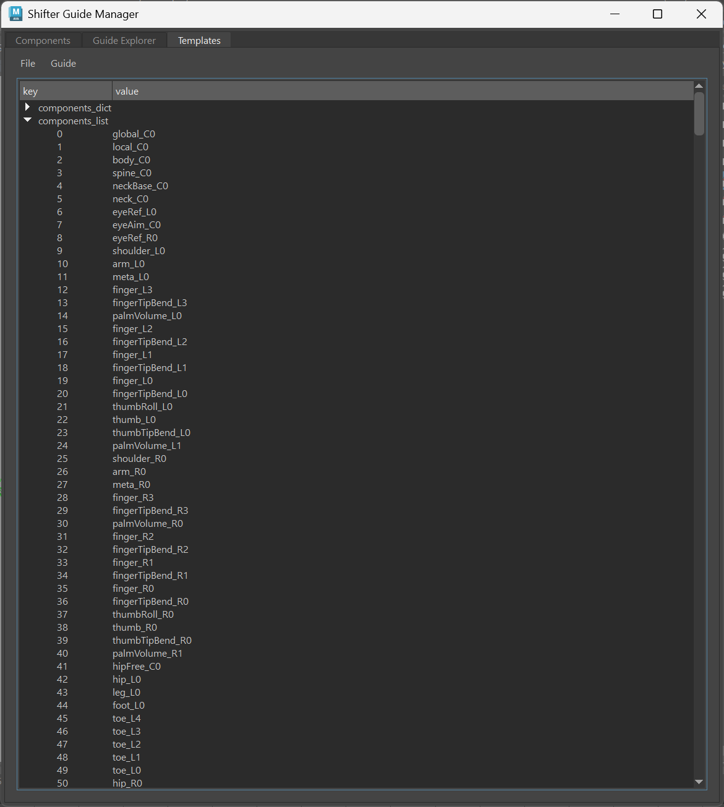

File Menu
++++++++++++++++++

**Open**

Load a guide template from a JSON file using a file browser.

**Load Selected Guide**

Extract guide data from the currently selected guide root in the scene. The selected object must have an ``is_rig`` attribute.

**Save As...**

Export the current template to a JSON file. Opens a file save dialog for specifying the file name and location.

**Clear**

Remove the currently loaded template from the viewer.

Guide Menu
++++++++++++++++++

**Build**

Build a rig from the currently loaded template. A template must be loaded before building.

**Import**

Import the entire loaded template as a new guide structure. This creates all components defined in the template.

**Import Partial**

Import only the selected component from the template:

- Select a component from the template tree view
- If an object is selected in the scene, it will be used as the parent
- Only component nodes can be imported (not other template data)

**Diff Tool**

Open the Guide Diff Tool for comparing templates.

Template Tree View
++++++++++++++++++

Displays the loaded template as a hierarchical JSON structure:

- Expandable/collapsible nodes for navigating template data
- Select components from the tree to use with Import Partial
- Shows guide root settings, component definitions, and custom steps

Diff Tool
++++++++++++++++++

The Diff Tool allows you to compare the loaded template against a master template to identify differences.

**Comparison Options:**

- **Missing Guide Components**: Find components in the master template that are not in the current template
- **Extra Guide Components**: Find components in the current template that are not in the master
- **Transform Differences**: Detect position and rotation mismatches between components
- **Root Settings Differences**: Compare guide root attribute settings
- **Component Settings Differences**: Compare component-specific settings
- **Custom Step Differences**: Check for variations in custom build steps

**Usage:**

1. Load a template in the Templates tab
2. Open the Diff Tool from Guide > Diff Tool
3. Click "Load Template" to select a master template for comparison
4. Enable the desired comparison options
5. Click "Run Test" to execute the comparison
6. Review the detailed comparison report in the console

Template Workflow Examples
+++++++++++++++++++++++++++

**Creating a Template:**

1. Build your guide in the scene
2. Open the Templates tab
3. Use File > Load Selected Guide to load the guide data
4. Use File > Save As... to export as a JSON template

**Building from a Template:**

1. Use File > Open to load a saved template
2. Use Guide > Build to create the rig

**Importing Components:**

1. Load a template containing the components you need
2. Select a parent object in the scene (optional)
3. Select the component in the template tree
4. Use Guide > Import Partial to add just that component

**Comparing Templates:**

1. Load your current template
2. Open Guide > Diff Tool
3. Load a reference template to compare against
4. Select comparison options and run the test
5. Review differences and update as needed

.. _guide-settings:

Guide Settings
==============================================

The Guide Settings panel provides comprehensive control over how your rig is built. Access these settings by selecting the guide root and opening the settings from the Guide Manager or by using **Shifter > Guide Settings**.

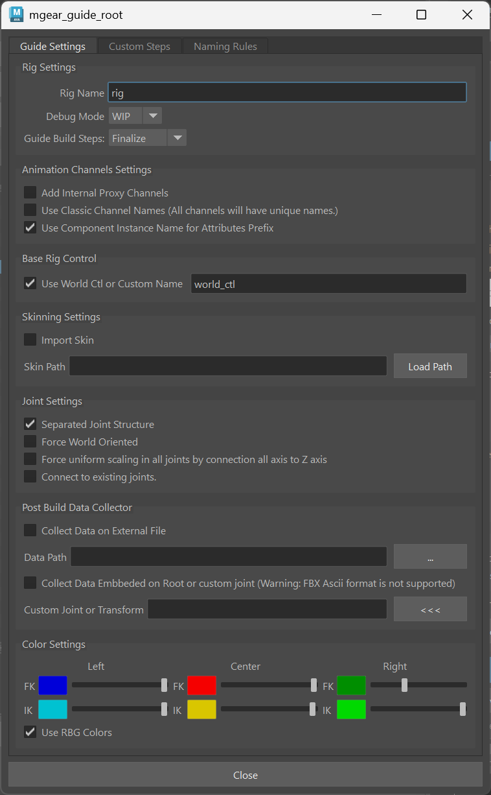

.. _main-guide-settings:

Main Settings
--------------

The main settings tab controls the core behavior of your rig build.

Rig Identity
++++++++++++++++++

**Rig Name**

The name used for the generated rig. This name is used as the root group name and affects naming throughout the rig hierarchy.

**Mode**

- **Final**: Production-ready rig build
- **WIP**: Work-in-progress mode for development and testing

**Build Step**

Controls how much of the rig build process to execute. Useful for debugging or incremental builds:

- **All Steps**: Complete rig build
- **Objects**: Create geometry and control shapes only
- **Properties**: Add attributes to objects
- **Operators**: Setup deformers and constraints
- **Connect**: Connect components together
- **Joints**: Create joint structure
- **Finalize**: Cleanup and optimization

World Control
++++++++++++++++++

**World Control**

When enabled, uses ``world_ctl`` instead of the component-based ``global_C0_ctl`` as the top-level control.

**World Control Name**

Custom name for the world control (default: "world_ctl").

Animation Channels
++++++++++++++++++

**Proxy Channels**

Add internal proxy channels for animation data transfer.

**Classic Channel Names**

Use unique full names for all channels, ensuring no naming conflicts across the rig.

**Attribute Prefix Name**

Use the component instance name instead of the type name for attribute prefixes, providing more specific attribute naming.

Joint Settings
++++++++++++++++++

**Separated Joint Structure**

Create a separate joint hierarchy independent from the control hierarchy. This is the recommended workflow for game engines and clean deformation setups.

**Force World Oriented**

Orient all joints to world space rather than inheriting local orientations.

**Force Uniform Scaling**

Force all joints to use uniform scaling, preventing non-uniform scale issues in deformation.

**Connect to Existing Joints**

Connect the rig to pre-existing joints in the scene, useful for updating rigs without losing skin weights.

**Force Segment Scale Compensation**

Apply segment scale compensation (SSC) to all joints for consistent scaling behavior.

Skinning
++++++++++++++++++

**Import Skin**

Automatically load pre-saved skin weights during rig build.

**Skin Path**

Path to the ``.gSkin`` file containing skin weight data.

Color Settings
++++++++++++++++++

**Use RGB Color**

When enabled, uses RGB color values instead of Maya's color index system for control colors.

**Color Indices (0-31)**

Maya color palette indices for controls:

- **Left FK/IK Color**: Colors for left-side FK and IK controls
- **Right FK/IK Color**: Colors for right-side FK and IK controls
- **Center FK/IK Color**: Colors for center FK and IK controls

**RGB Color Values**

When RGB mode is enabled, specify exact RGB values for each control type.

Data Collection
++++++++++++++++++

**Collect Data on External File**

Save rig data to an external file for pipeline integration.

**Data Collector Path**

Path to the ``.gnx`` file where rig data will be saved.

**Collect Data Embedded**

Store rig data directly in the root joint's attributes.

**Custom Joint for Data**

Specify an alternative joint for storing embedded data.

.. _custom-steps:

Custom Steps
--------------

Custom Steps is one of the most powerful features in mGear's data-centric workflow. It allows you to extend the rig build process with custom Python scripts that execute before or after the main build, enabling infinite customization possibilities.

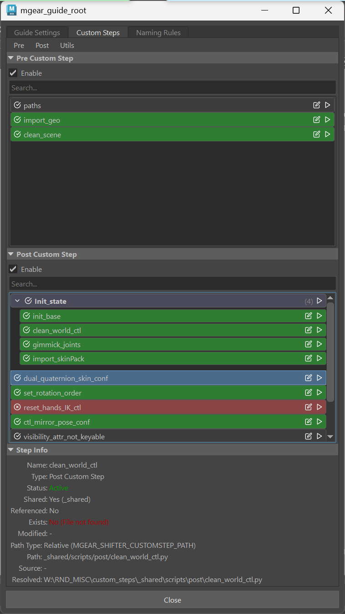

The Data-Centric Workflow
++++++++++++++++++++++++++

mGear follows a data-centric architecture where custom steps can:

- **Read and modify shared data** through a step dictionary passed between all steps
- **Access built rig components** to modify controls, joints, and connections
- **Execute at specific build phases** (pre-build or post-build)
- **Be organized in groups** for logical categorization and management
- **Be referenced from external files** for team sharing and reusability

This architecture enables you to build a library of reusable customization scripts that can be applied across multiple rigs and shared across teams.

Pre vs Post Custom Steps
++++++++++++++++++++++++++

**Pre-Custom Steps**

Execute BEFORE the main rig build process. Use these for:

- Preparing the scene (cleaning up, organizing)
- Setting up data that components will use
- Validating guide structure before building
- Creating helper objects that components need

**Post-Custom Steps**

Execute AFTER the main rig build is complete. Use these for:

- Adding custom controls or attributes
- Setting up space switches
- Creating selection sets
- Applying color overrides
- Building custom deformers
- Connecting to external systems

Step Data Structure
++++++++++++++++++++++++++

Each custom step contains:

- **Name**: Display name for the step (e.g., "apply_colors")
- **Path**: Relative or absolute path to the Python script
- **Active**: Toggle to enable/disable the step without removing it

**Path Resolution**

Paths can be specified as:

- **Absolute paths**: Full system path to the script
- **Relative paths**: Resolved against the ``MGEAR_SHIFTER_CUSTOMSTEP_PATH`` environment variable

**Inactive Steps**

Steps can be deactivated by unchecking their checkbox. Inactive steps are preserved in the configuration but skipped during execution, making it easy to temporarily disable steps for testing.

Groups
++++++++++++++++++

Groups allow you to organize custom steps into logical collections. This is especially useful for complex rigs with many customization steps.

**Group Features:**

- **Collapsible**: Groups can be collapsed/expanded in the UI to reduce clutter
- **Master Active Control**: Disabling a group disables all steps within it
- **Drag and Drop**: Reorder groups and move steps between groups
- **Visual Organization**: Group related steps (e.g., "Face Setup", "Hand Controls", "Space Switches")

**Creating Groups:**

1. Right-click in the custom steps area
2. Select "Create New Group"
3. Enter a name for the group
4. Drag existing steps into the group or add new steps directly

**Group Hierarchy:**

Steps within groups inherit the group's active state. If a group is disabled, all contained steps are skipped even if individually marked as active.

Context Menu
++++++++++++++++++

Right-click on steps or groups to access additional options:

.. image:: images/shifter/guide_settings/custom_steps_right_click_menu.png
    :align: center

- **Edit Step**: Open the Python file in your configured external editor
- **Run Step**: Execute the step individually for testing
- **Toggle Active**: Enable/disable the step
- **Delete**: Remove the step or group
- **Create New Group**: Add a new group for organization
- **Load Referenced Group**: Import steps from an external ``.scs`` file

External File References (.scs)
++++++++++++++++++++++++++++++++

Custom steps can be referenced from external Shifter Custom Steps (``.scs``) files. This enables:

- **Team Sharing**: Share step configurations across team members
- **Version Control**: Track step configurations in source control
- **Reusability**: Apply the same steps to multiple rigs
- **Centralized Updates**: Update steps in one place, apply to all rigs

**SCS File Format (JSON):**

.. code-block:: json

    {
        "items": [
            {
                "type": "group",
                "name": "Animation Setup",
                "collapsed": false,
                "active": true,
                "items": [
                    {
                        "type": "step",
                        "name": "space_switches",
                        "path": "steps/space_switches.py",
                        "active": true
                    },
                    {
                        "type": "step",
                        "name": "selection_sets",
                        "path": "steps/selection_sets.py",
                        "active": true
                    }
                ]
            }
        ]
    }

**Loading Referenced Groups:**

1. Right-click in the custom steps area
2. Select "Load Referenced Group"
3. Browse to your ``.scs`` file
4. The group is added as a read-only reference

**Referenced Group Behavior:**

- Referenced groups appear with a special indicator
- Individual steps cannot be edited (read-only)
- You can toggle the active state of the entire group
- Updates to the source ``.scs`` file are reflected when the rig is rebuilt

Writing Custom Steps
++++++++++++++++++++++++++

Custom steps are Python classes that inherit from ``customShifterMainStep``:

.. code-block:: python

    from mgear.shifter.custom_step import customShifterMainStep

    class CustomShifterStep(customShifterMainStep):

        def setup(self):
            """Initialize the step - set the name"""
            self.name = "my_custom_step"

        def run(self):
            """Execute the step logic"""
            # Access the rig object
            rig = self.rig

            # Access a specific component
            arm = self.component("arm_L0")

            # Access all components of a type
            fk_components = self.components_by_type("EPIC_arm_01")

            # Access data from previous steps
            previous_step = self.custom_step("other_step_name")

            # Create organization group for custom objects
            setup_root = self.get_or_create_setup_root()

Available Properties
^^^^^^^^^^^^^^^^^^^^

**self.rig**

Alias for ``self.mgear_run`` providing intuitive access to the Shifter rig object. Use this to access rig-wide data and controls.

.. code-block:: python

    def run(self):
        # Access the global control
        global_ctl = self.rig.global_ctl

        # Access the rig's setup group
        setup_grp = self.rig.setupWS

        # Get all components
        all_components = self.rig.components

**self.guide**

Access to the guide object from the rig build (if available).

.. code-block:: python

    def run(self):
        if self.guide:
            # Access guide data
            guide_model = self.guide.model

Available Methods
^^^^^^^^^^^^^^^^^

**self.component(name)**

Get a component by its full name (e.g., "arm_L0"). Raises ``KeyError`` if the component is not found.

.. code-block:: python

    def run(self):
        # Get a specific component
        arm = self.component("arm_L0")

        # Access component controls
        fk_ctl = arm.fk_ctl
        ik_ctl = arm.ik_ctl

**self.has_component(name)**

Check if a component exists without raising an error. Returns ``True`` if the component exists, ``False`` otherwise.

.. code-block:: python

    def run(self):
        # Safely check for optional components
        if self.has_component("tail_C0"):
            tail = self.component("tail_C0")
            self.log("Found tail component")
        else:
            self.log("No tail component in this rig", level="warning")

**self.components_by_type(comp_type)**

Get all components of a specific type. Returns a list of matching components.

.. code-block:: python

    def run(self):
        # Get all control_01 components
        all_controls = self.components_by_type("control_01")
        for ctrl in all_controls:
            self.log("Found control: {}".format(ctrl.fullName))

        # Process all arm components
        arms = self.components_by_type("EPIC_arm_01")
        for arm in arms:
            # Apply custom setup to each arm
            self.setup_arm_spaces(arm)

**self.custom_step(name)**

Access a custom step that has already been executed. Raises ``KeyError`` if the step hasn't run yet.

.. code-block:: python

    def run(self):
        # Access data from a previous step
        color_step = self.custom_step("apply_colors")
        colors_used = color_step.color_palette

**self.has_custom_step(name)**

Check if a custom step has been executed without raising an error.

.. code-block:: python

    def run(self):
        # Check for optional dependency
        if self.has_custom_step("proxy_setup"):
            proxy = self.custom_step("proxy_setup")
            # Use proxy data
        else:
            self.log("Proxy setup not available", level="warning")

**self.get_or_create_setup_root(name)**

Get or create a setup root group for organizing custom step objects. The group is automatically parented under the rig's setup group.

.. code-block:: python

    def run(self):
        # Create a setup group for this step's objects
        setup_grp = self.get_or_create_setup_root()

        # Create custom objects and parent them
        my_locator = pm.spaceLocator(name="custom_loc")
        pm.parent(my_locator, setup_grp)

        # Use a custom name for the setup root
        custom_grp = self.get_or_create_setup_root("my_custom_setup")

**self.log(message, level)**

Log a message with the step name as a prefix. The ``level`` parameter can be "info" (default), "warning", or "error".

.. code-block:: python

    def run(self):
        self.log("Starting custom step processing")
        # Output: [my_custom_step] Starting custom step processing

        self.log("Missing optional attribute", level="warning")
        # Displays as Maya warning

        self.log("Critical error occurred", level="error")
        # Displays as Maya error

Running Sub-Steps
^^^^^^^^^^^^^^^^^

**self.run_sub_step(module_name, step_path)**

Load and run another custom step from an external module. This powerful method enables modular step design by allowing you to break complex operations into smaller, reusable steps.

The sub-step will have access to the same step dictionary, components, and rig context as the parent step.

**Parameters:**

- ``module_name``: The name of the Python module/file without the ``.py`` extension
- ``step_path`` (optional): The directory path where the module is located. If not provided, checks the ``MGEAR_SHIFTER_CUSTOMSTEP_PATH`` environment variable

**Basic Usage:**

.. code-block:: python

    def run(self):
        # Run a sub-step from a specific path
        self.run_sub_step("apply_colors", "W:/my_steps")

        # Run a sub-step using MGEAR_SHIFTER_CUSTOMSTEP_PATH env var
        self.run_sub_step("setup_spaces")

        # Run a sub-step that's already in Python's path
        self.run_sub_step("mirror_controls")

**Accessing Sub-Step Data:**

.. code-block:: python

    def run(self):
        # Run the sub-step and get immediate access
        color_step = self.run_sub_step("apply_colors", "W:/my_steps")
        self.log("Colors applied: {}".format(color_step.colors_applied))

        # Or access it later via custom_step()
        self.run_sub_step("setup_proxies", "W:/my_steps")
        # ... other code ...
        proxy_step = self.custom_step("setup_proxies")

**Modular Step Architecture Example:**

Main step file (``main_setup.py``):

.. code-block:: python

    from mgear.shifter.custom_step import customShifterMainStep

    class CustomShifterStep(customShifterMainStep):

        def setup(self):
            self.name = "main_setup"

        def run(self):
            self.log("Running main setup...")

            # Run color application
            self.run_sub_step("apply_colors", "W:/steps")

            # Run space switching setup
            self.run_sub_step("setup_spaces", "W:/steps")

            # Run selection sets creation
            self.run_sub_step("create_sets", "W:/steps")

            self.log("Main setup complete!")

Sub-step file (``apply_colors.py``):

.. code-block:: python

    from mgear.shifter.custom_step import customShifterMainStep

    class CustomShifterStep(customShifterMainStep):

        def setup(self):
            self.name = "apply_colors"
            self.colors_applied = []

        def run(self):
            self.log("Applying control colors...")

            # Get all arm components and apply colors
            arms = self.components_by_type("EPIC_arm_01")
            for arm in arms:
                # Apply color logic
                self.colors_applied.append(arm.fullName)

            self.log("Applied colors to {} components".format(
                len(self.colors_applied)))

**Benefits of Sub-Steps:**

- **Modularity**: Break complex setups into focused, single-purpose steps
- **Reusability**: Share common operations across multiple rigs
- **Maintainability**: Update individual sub-steps without modifying the main step
- **Testing**: Test sub-steps independently before integrating
- **Team Collaboration**: Different team members can work on different sub-steps

Step Dictionary
^^^^^^^^^^^^^^^

All steps share a common dictionary (``customStepDic``) that enables inter-step communication:

- Each executed step is stored in this dictionary using its name as the key
- Steps can access data set by previous steps via ``self.custom_step(name)``
- Sub-steps are automatically registered in this dictionary
- Use this for passing complex data between steps

.. _custom-step-templates:

Custom Step Templates
++++++++++++++++++++++++++

When creating a new custom step, mGear provides a template selection dialog that offers pre-built templates for common tasks. This accelerates development by providing ready-to-use code patterns.

**Accessing Templates:**

1. Click the **New** button in the Custom Steps panel
2. A template selection dialog appears with a dropdown menu
3. Select a template and click **OK**
4. Choose a save location for your new custom step file
5. The file is created with the selected template code

**Available Templates:**

- **Blank**: Empty custom step with ``setup()`` and ``run()`` methods. Use this as a starting point for completely custom logic.

- **Import Skin Pack**: Imports skin weights from a ``.gSkinPack`` file. Useful for re-applying skin weights after rig rebuilds.

- **Import Guide Visualizer Configuration**: Imports guide visualizer settings (display curves, colors, labels) from a JSON file.

- **Import RBF Configuration**: Imports RBF Manager setups from a JSON file exported by the RBF Manager tool.

- **Import SDK Configuration**: Imports Set Driven Keys from a JSON file exported by the SDK Manager tool.

- **Import Eye Rigger Configuration**: Builds eye rigs from Eye Rigger 2.1 JSON configuration files. Supports separate left and right eye configurations.

- **Import Channel Master Configuration**: Imports Channel Master node configuration from a ``.cmc`` file.

- **Import Anim Picker Template**: Imports Anim Picker data from a ``.pkr`` file with an option to reparent the picker node under the rig root.

**Template Configuration Options:**

Each template provides three ways to configure file paths:

1. **Hardcoded Path**: Set the path directly in the script for automated builds

   .. code-block:: python

       self.config_path = "path/to/your/config.json"

2. **Relative Path**: Use a path relative to the script location

   .. code-block:: python

       import os
       script_dir = os.path.dirname(__file__)
       self.config_path = os.path.join(script_dir, "config.json")

3. **File Dialog**: Leave as ``None`` to show a file dialog at runtime (default)

   .. code-block:: python

       self.config_path = None

**Adding Custom Templates:**

Templates are stored in ``mgear/shifter/custom_step_templates/``. To add a new template:

1. Create a new Python file in the ``custom_step_templates`` folder
2. Define a ``TEMPLATE`` variable containing the template code as a raw string
3. Use ``{stepName}`` as a placeholder for the step name (replaced during creation)
4. Escape any curly braces in the template with double braces ``{{}}``
5. Register the template in ``__init__.py`` by adding an entry to the ``TEMPLATES`` dictionary

Example template file:

.. code-block:: python

    """My Custom Template description."""

    TEMPLATE = r'''import mgear.shifter.custom_step as cstp

    class CustomShifterStep(cstp.customShifterMainStep):

        def setup(self):
            self.name = "{stepName}"

        def run(self):
            self.log("Running my custom step...")
            return'''

.. _blueprint-guide:

Blueprint Guide
--------------

The Blueprint Guide feature enables studios to define standardized rig settings that can be shared across multiple characters. This powerful data-centric workflow allows you to create a master template from which individual rigs inherit their settings, while still allowing per-section and per-component local overrides.

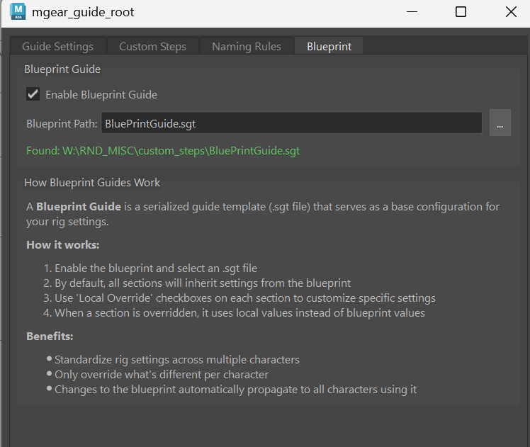

Overview
++++++++++++++++++

A **Blueprint Guide** is a serialized guide template (``.sgt`` file) that serves as a base configuration for your rig settings. When enabled, your guide inherits settings from the blueprint, and you can selectively override specific sections or components as needed.

**Key Benefits:**

- **Standardization**: Define rig settings once and share them across multiple characters
- **Efficiency**: Only customize what's different per character
- **Propagation**: Changes to the blueprint automatically apply to all characters using it
- **Flexibility**: Full control over which settings to inherit vs. override locally

Enabling Blueprint Guide
+++++++++++++++++++++++++++

1. Open the Guide Settings panel by selecting the guide root
2. Navigate to the **Blueprint** tab
3. Check **Enable Blueprint Guide**
4. Click the browse button (**...**) to select a ``.sgt`` file
5. The status will show the resolved path if the file is found

**Path Resolution:**

Blueprint paths can be specified as:

- **Absolute paths**: Full system path to the ``.sgt`` file
- **Relative paths**: Resolved against the ``MGEAR_SHIFTER_CUSTOMSTEP_PATH`` environment variable

Guide Settings Local Override
++++++++++++++++++++++++++++++

When a blueprint is enabled, each section in the Guide Settings tab becomes controllable via a **Local Override** checkbox in the section title.

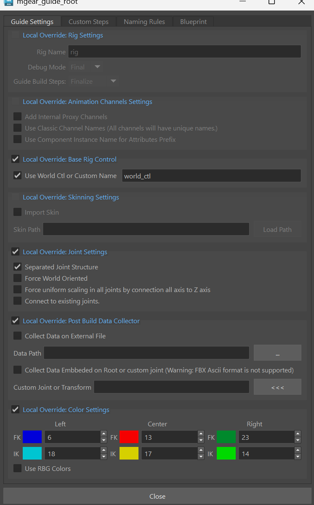

**Override Behavior:**

- **Unchecked (Blue Title)**: Section inherits settings from the blueprint. Widgets are disabled and greyed out.
- **Checked (Blue Title)**: Section uses local settings. Widgets are enabled and editable.

**Sections with Local Override:**

- Rig Settings
- Animation Channels Settings
- Base Rig Control
- Skinning Settings
- Joint Settings
- Post Build Data Collector
- Color Settings
- Naming Rules (separate tab)
- Pre Custom Steps (Custom Steps tab)
- Post Custom Steps (Custom Steps tab)

Custom Steps Blueprint Integration
+++++++++++++++++++++++++++++++++++

The Custom Steps tab has special blueprint integration features accessible via the **Blueprint** menu.

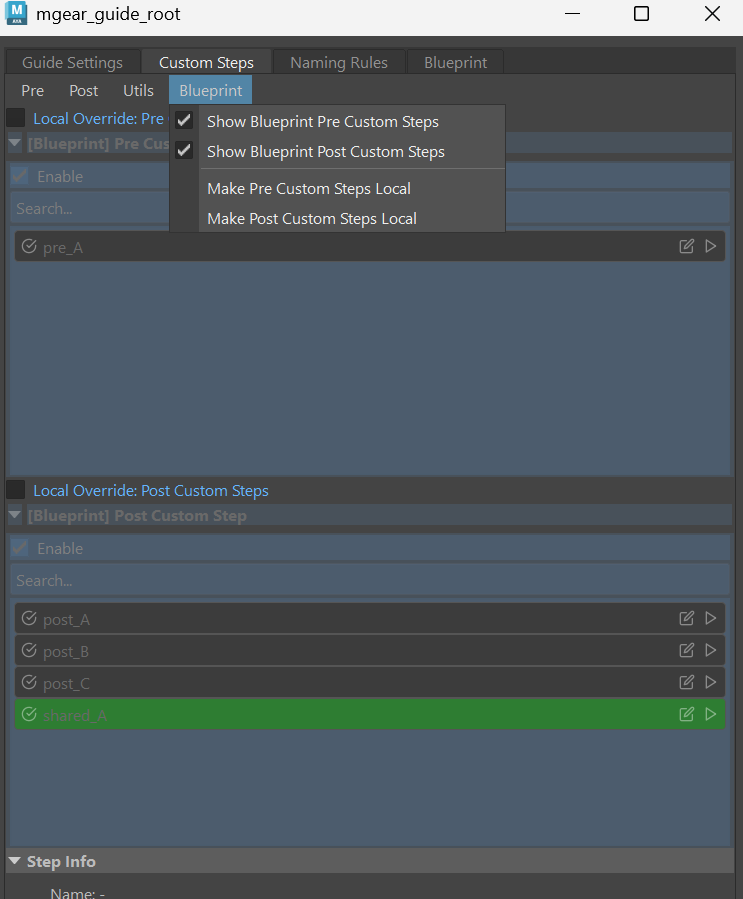

**Blueprint Menu Options:**

- **Show Blueprint Pre Custom Steps**: Toggle visibility of blueprint's pre-custom steps (read-only view)
- **Show Blueprint Post Custom Steps**: Toggle visibility of blueprint's post-custom steps (read-only view)
- **Make Pre Custom Steps Local**: Copy blueprint pre-custom steps to local for editing
- **Make Post Custom Steps Local**: Copy blueprint post-custom steps to local for editing

When viewing blueprint custom steps, they appear with a **[Blueprint]** prefix and are read-only. Use the "Make Local" commands to copy them to your local guide for modification.

Component Blueprint Settings
++++++++++++++++++++++++++++++

Individual components can also inherit settings from the blueprint. When a blueprint is active and contains a matching component (same name, side, and index), a blueprint header appears above the component settings tabs.

.. image:: images/shifter/blueprint_guide/blueprint_component_settings.png
    :align: center

**Component Blueprint Header:**

- **Blue Indicator**: Shows that the component exists in the blueprint
- **Blueprint Local Override**: Checkbox to use local settings instead of blueprint
- **View**: Opens a dialog showing the blueprint's settings for this component
- **Copy**: Copies all blueprint settings to local and enables local override

Guide Explorer Color Coding
++++++++++++++++++++++++++++++

When a blueprint is active, the Guide Explorer tree uses color coding to indicate each component's blueprint status.

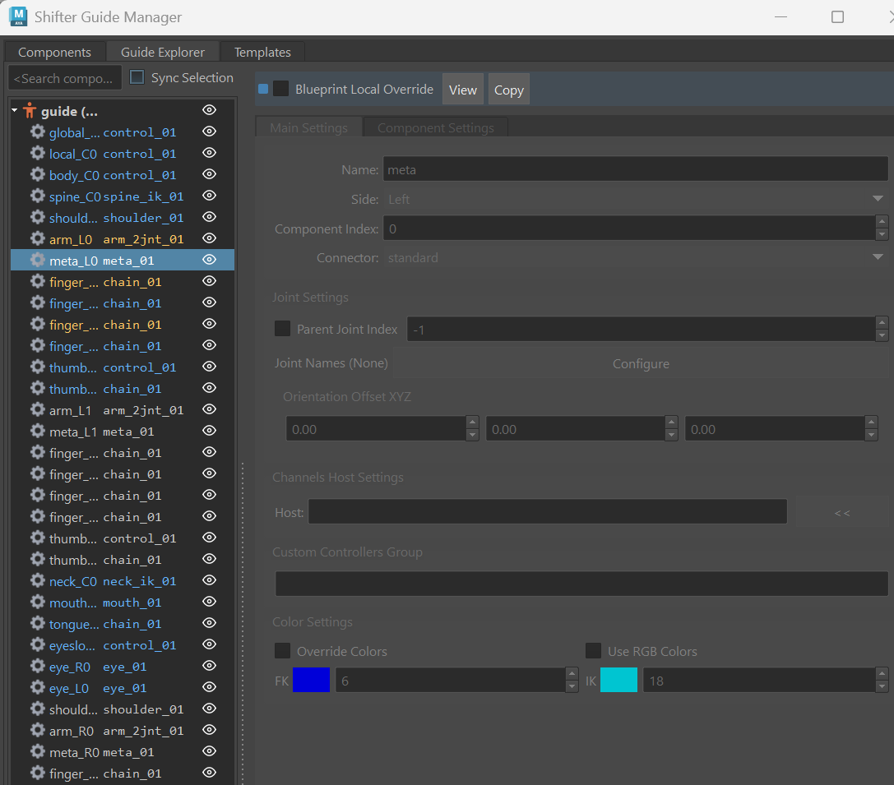

**Color Legend:**

- **Blue Text**: Component exists in blueprint and is using blueprint settings (no local override)
- **Yellow/Orange Text**: Component exists in blueprint but has local override enabled
- **Default Text**: Component does not exist in the blueprint

This visual feedback makes it easy to see at a glance which components are inheriting from the blueprint and which have been customized locally.

Blueprint Workflow Example
++++++++++++++++++++++++++++++

**Creating a Blueprint:**

1. Build a master guide with your studio's standard settings
2. Configure all guide settings, naming rules, custom steps, and component settings
3. Export the guide as a template: **Shifter > Export Guide Template**
4. Save as your blueprint ``.sgt`` file (e.g., ``studio_biped_blueprint.sgt``)

**Using a Blueprint:**

1. Create or open a character-specific guide
2. Enable Blueprint Guide and select your blueprint file
3. All sections default to inheriting from the blueprint
4. Check **Local Override** only on sections that need character-specific settings
5. Build your rig - it will use blueprint values for non-overridden sections

**Updating a Blueprint:**

1. Modify the blueprint ``.sgt`` file
2. All guides using that blueprint will automatically use the new settings on their next build
3. Local overrides are preserved - only non-overridden sections receive the updates

.. _naming-rules:

Naming Rules
--------------

The Naming Rules panel allows you to customize how controls, joints, and other rig elements are named. This is essential for pipeline integration and studio naming conventions.

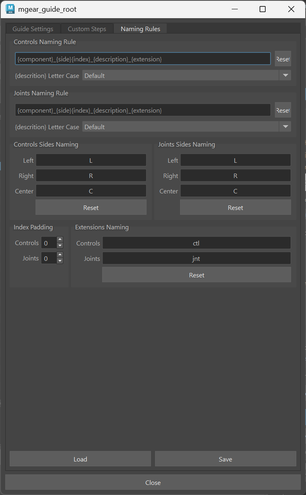

Naming Templates
++++++++++++++++++

Naming rules use tokens that are replaced with actual values during rig build:

- ``{side}``: The side identifier (L, R, C)
- ``{component}``: The component name
- ``{description}``: Additional description from the component
- ``{index}``: Numerical index
- ``{type}``: Element type (ctl, jnt, etc.)

**Control Naming Rule**

Template for control names. Default: ``{side}_{component}_{description}_{index}_{type}``

Example result: ``L_arm_fk_001_ctl``

**Joint Naming Rule**

Template for joint names. Default: ``{side}_{component}_{description}_{index}_{type}``

Example result: ``L_arm_fk_001_jnt``

Side Names
++++++++++++++++++

Customize the side identifiers used in naming:

- **Left Name**: Default "L" (e.g., could be "left" or "lf")
- **Right Name**: Default "R" (e.g., could be "right" or "rt")
- **Center Name**: Default "C" (e.g., could be "center" or "cn")

**Joint Side Names**

Separate side naming for joints if different from controls:

- **Joint Left Name**: Default "L"
- **Joint Right Name**: Default "R"
- **Joint Center Name**: Default "C"

Name Extensions
++++++++++++++++++

Suffixes added to element names:

- **Control Extension**: Default "_ctl" (e.g., could be "_ctrl" or "_CON")
- **Joint Extension**: Default "_jnt" (e.g., could be "_joint" or "_JNT")

Letter Case
++++++++++++++++++

Control how descriptions are capitalized:

- **Default**: Keep original case
- **Upper Case**: Convert to uppercase (e.g., "FK" instead of "fk")
- **Lower Case**: Convert to lowercase (e.g., "fk" instead of "FK")
- **Capitalization**: Capitalize first letter (e.g., "Fk" instead of "fk")

These can be set independently for controls and joints.

Index Padding
++++++++++++++++++

Control zero-padding for numerical indices:

- **Control Index Padding**: Number of digits (e.g., 3 = "001", "002")
- **Joint Index Padding**: Number of digits for joint indices

Setting to 0 uses no padding (e.g., "1", "2", "10").

Import/Export Naming Configuration
++++++++++++++++++++++++++++++++++++

Save and load naming configurations for consistency across projects:

**Save Configuration**

Export current naming rules to a ``.naming`` JSON file for backup or sharing.

**Load Configuration**

Import naming rules from a previously saved ``.naming`` file.

**Configuration File Format:**

.. code-block:: json

    {
        "ctl_name_rule": "{side}_{component}_{description}_{index}_{type}",
        "joint_name_rule": "{side}_{component}_{description}_{index}_{type}",
        "side_left_name": "L",
        "side_right_name": "R",
        "side_center_name": "C",
        "side_joint_left_name": "L",
        "side_joint_right_name": "R",
        "side_joint_center_name": "C",
        "ctl_name_ext": "_ctl",
        "joint_name_ext": "_jnt",
        "ctl_description_letter_case": 0,
        "joint_description_letter_case": 0,
        "ctl_index_padding": 0,
        "joint_index_padding": 0
    }

Plebes - Instant Rigged Characters Using mGear
==============================================

Plebes is a simple template based tool to quickly rig characters from various character generators, such as DazStudio, Character Creator 3,  MakeHuman or Mixamo. What it does is build an mGear rig that matches the proportions of your character, and then constrains the joints of that character to the rig with just a few clicks.

.. image:: images/shifter/plebes_ui.png

How to Rig Plebes
-----------------

1) Open Plebes interface from the mGear>Shifter>Plebes... menu.
2) Export the character from the character generator as FBX and bring it into Maya.
3) Select the **Character Template** that matches your character generator.
4) Follow the template specific instructions in the Plebes interface.
5) Press **Import Guides** to import the mGear biped guides.
6) Press **Align Guides** to align the mGear guides to your character's joints.
7) Look over the guides, and manually adjust any that are off (e.g. typically the heel and sides of the feet).
8) Press **Build Rig** to build the rig.
9) Press **Attach Plebe to Rig** to constrain the character to the mGear rig. This  also removes any locks, keys/connections and/or limits on the translate, rotate and scale attributes on the character's original joints.

You can delete the rig, adjust the guides and rebuild it, like you can normally with mGear, by simply deleting the "rig" group and running the last two steps again.

.. note::
   Some character generators build their characters with completely straight or misaligned elbows and knees, which makes it impossible for mGear to figure out where to aim the knee or elbow, so you may need to rotate the joints slightly before aligning the guides to them, to make sure they are pointing in the right direction.

Known Limitations
-----------------

Plebes is meant to quickly rig generic characters, typically for use in the background or for crowd agents, so has some limitations. If you need more of a hero rig, you can use the guide placement as a starting point, but it's probably a good idea to skin the character directly to your mGear joints, rather than using **Attach Plebe to Rig**. Other known limitations include:

- Stretching and scaling of limbs may not work correctly for all templates, though it should work fine for all "normal" animation.
- Some characters come with additional joints, such as face joints, that Plebes does not add any controls to.

Plebe Templates
---------------

What gets aligned and constrained to what is defined by simple JSON templates. Plebes ships with templates for the several commonly used character genrators, but should you want to add more or modify the existing ones, you can easily do so. You can define the location of additional templates by defining the environment variable PLEBE_TEMPLATES_DIR. You can have multiple template dirs, so you can add your custom ones from your home folder or project specific ones as needed, just make sure each tamplate has a unique name.

The templates look like this:

.. code-block:: json

    {
        "help": "This show up when you hover over the template menu.",
        "root": "CC_Base_BoneRoot",
        "guides": [
            {"guide": "CC_Base_BoneRoot"},
            {"neck_C0_tan0": [
                "CC_Base_NeckTwist01",
                "CC_Base_NeckTwist02"
            ]}
        ],
        "settings": [
            {"arm_L0_root": [
                { "div0": 1 },
                { "div1": 1 },
                { "supportJoints": 0}
            ]}
        ],
        "joints": [
            {"local_C0_ctl": {
                "joint": "CC_Base_BoneRoot",
                "constrain": "111"}
            },
            {"spine_C0_0_jnt": {
                "joint": "CC_Base_Hip",
                "constrain": "110"}
            }
        ]
    }

- **help** - Documentation that shows up in the interface, detaling any specific things you need to do to work with this template.
- **root** - The top level joint/node from the character generator.
- **guides** - List of which guides to position at which joints.
    - If you match it to a list of joints, like with the neck above, it will be placed between them.
- **settings** - Settings to adjust on the guides before building the rig. Typically this is number of twist joints, but can be any attribute and value combination.
- **joints** - List of mGear joints and which of the character's joints to constrain to it.
    - **joint** - Name of the character's joint to constrain to mGear.
    - **constain** - Three 0 or 1's. First is if to point constraint, second is orient and third is scale.

.. _shifter-fbx-exporter:

Shifter's FBX Exporter
==============================================

The FBX exporter, allows you to export FBXs, as well having an integration into Unreal.

It supports the following Unreal processes:

- Exporting SKMs
- Exporting SKMs and using existing Skeletons
- Exporting Animation
- Exporting Animation layers

UI
-----------------

.. image:: images/shifter/fbx_exporter/fbx_shifter.png

* **File** - Allows for users to serialise there settings, incase they want to reload them, or use them in a scripted pipeline.

Source Elements
++++++++++++++++++

These are the elements that make up the FBX, Geometry and Skeleton structure.

.. image:: images/shifter/fbx_exporter/fbx_shifter_roots.png
    :align: center

In the image above you can see that the **geo_root** is a group that contains all the geometry objects.

**Geo Root**: The list of geometry object roots. There can be more then one depending on how you have structured your character.

**Joint Root**: The root bone of the skeleton.

Settings
++++++++++++++++++

You can specify the FBX export settings here.

It also allows for some extra conditioning of the data upon export.

- Remove Namespace
- Clean up scene.

File Path
++++++++++++++++++

- **Directory**: Location of the exported FBX files.
- **File Name**: Name of the fbx file that will be generated. This will also be used as the name of the **Unreal Assets**.

Unreal Engine Import
++++++++++++++++++++++

- **Enable Unreal Engine Import**: Enabling this, will allow for the other Unreal UI elements to become active. 
It also **refreshes** the **Unreal Skeleton** list, by querying the current open Unreal Project.

.. image:: images/shifter/fbx_exporter/fbx_shifter_ue_no_path.png
    :align: center

.. note::
    If you have selected a skeleton and no longer what to import using the selected skeleton, or wish to generate a new skeleton on import, ctr click on the selected element to deselect it.

- **Directory**: The import location in Unreal for the SKM and Animations.

    .. image:: images/shifter/fbx_exporter/fbx_shifter_ue_select_folder.png
        :align: center
    1) Navigate to the folder in Unreal that you want to import to.
    2) Select the folder in Unreal's **Content Browser**
    
    .. image:: images/shifter/fbx_exporter/fbx_shifter_ue_path.png
        :align: center
    3) Click the folder icon in the Shifter UI. 
    4) The Package path to the directory will be retrieved from Unreal. You can modify it as you please, and the folder structure will be generated on import.

Export
-----------------

Skeletal Mesh
++++++++++++++++++

Allows for the exporting of Skeletons and Geometry.

.. image:: images/shifter/fbx_exporter/fbx_shifter_export_geo.png
        :align: center

- **Skinning**: Export Skinning data
- **Blendshapes**: Export Blendshapes that exist on the geometry.
- **Partitions**: Export Partitioned FBXs.
- **Cull Joints**: With Cull Joints enabled, generated fbx partition files will have all unneccesary leaf nodes removed.
*Unnessary leaf nodes*, would be any joint that is no longer driving geometry and no longer required to drive any other joints that has skinning, to influence geometry that is part of the partition.

.. note::
    Exporting the Skeletal Mesh, will trigger a mayabatch session, that performs all the file conditioning, and then performs the fbx exporting.

**Partitions**

Performs partitioning of geometric data.
Partitions are designed to allow you to export once, and generate an FBX per a partition. Each generated FBX partition, will only contain the geometry that has been added to the partition.

- When you add the **geometry roots**, all geometry child objects will get added to the **Master** partition.

.. image:: images/shifter/fbx_exporter/fbx_shifter_export_geo_partitions.png
        :align: center

- Press the **"+"** button to create a custom partition. Once it has been created you can drag any other geometry objects from the master partition, to the custom partition.
- Right click on a Partition to change its colour, duplicate or delete it.
- Toggling the button on the partition, will disable it from being exported.

**Export Skeletal/SkinnedMesh**: Performs the FBX export, and if **"Enable Unreal Engine Import"** is active, the fbx's will be imported into the active Unreal Engine project.

.. note::
    If you want to use a pre-existing skeleton in Unreal, make sure to have selected the *skeleton* in the *Unreal Engine Imports* section. If you have not, a new Skeleton will be generated on import into Unreal. 

Animation
++++++++++++++++++

Exports the Maya animation as an FBX. **Clips** allow for sections of the maya timeline to be exported, while also utilising the animation layers.

.. image:: images/shifter/fbx_exporter/fbx_shifter_export_anim.png
        :align: center

**Clip**

Clips allow you to create named animation exportd, that represent a section of time on the maya timeline.
New Clips will automatically read the duration of the Maya timeline, and use that as the start and end frame.

- **Trash can**: Removes the clip.
- **Name of the clip** will be appended to the file. eg. *BoyA_ROM*, *BoyA_Clip_2*
- **Drop-down**: represents the animation layer that will have its animation read, and exported as the final FBX.
- **Start Frame**: The frame number that the animation will start at.
- **End Frame**: The frame number that the animation will end at.
- **Set timeline range**: Updated Mayas timeline to fit the range that is specified.
- **Play**: Plays back the clip on loop.
- **Tick Box**: Disabled the animation clip, stopping the clip from being exported.

**Animation Layers**

.. image:: images/shifter/fbx_exporter/fbx_shifter_animation_cb.png
        :align: center

- **None**: Uses the current configuration of active and disabled Animation Layers. Exporting exactly what you see in scene.
- Any other selected animation layer, will export the **Animation Layer** and **Mayas BaseAnimation**

.. image:: images/shifter/fbx_exporter/fbx_shifter_maya_anim_layers.png
        :align: center

.. _shifter-guide-utils:

Guide Utils Tools
==============================================

The Guide Utils submenu contains a collection of tools designed to help you work more efficiently with mGear guides. These tools provide functionality for visualizing guides, managing symmetry, organizing components, and manipulating chain structures.

Access these tools from the menu: **Shifter > Guide Utils**

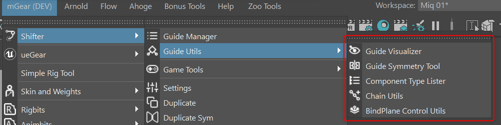

.. _guide-visualizer:

Guide Visualizer
-----------------

The Guide Visualizer is a comprehensive tool for customizing the visual appearance of your guides. It allows you to create display curves, adjust colors and thickness, scale control vertices, and manage guide labels.

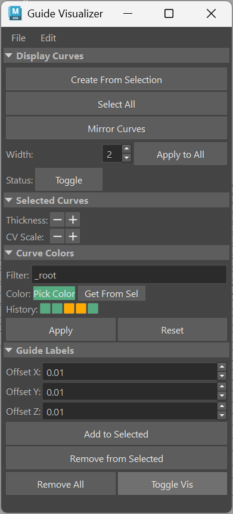

Features
++++++++++++++++++

**Display Curves**

Display curves are visual connection lines between guide nodes that help you understand the guide hierarchy and relationships.

- **Create Curve**: Creates a display curve connecting selected guide nodes.
- **Mirror Curve**: Mirrors an existing display curve to the opposite side of the rig.
- **Select Curve**: Selects display curves for editing.
- **Delete Curve**: Removes selected display curves.

**Curve Thickness**

Adjust the line width of display curves to improve visibility or match your preferred visual style.

- **Individual Adjustment**: Modify the lineWidth attribute for specific curves.
- **Global Adjustment**: Apply thickness changes to all display curves at once.

**Curve Colors**

Customize the color of display curves using RGB color values.

- **Color Picker**: Select colors using an interactive color picker.
- **Color History**: Access previously used colors for quick reapplication.
- **Apply to Selection**: Apply colors to selected curve shapes.

**CV Scaling**

Scale the control vertices (CVs) of curves to adjust their visual size.

- **Scale Up/Down**: Incrementally scale CVs with cumulative tracking.
- **Reset Scale**: Return CVs to their original size.

**Guide Labels**

Create and manage annotation labels on guides for better organization and documentation.

- **Create Label**: Add text annotations to guide nodes.
- **Remove Label**: Delete existing labels.
- **Custom Offset**: Adjust label positioning relative to the guide.

**Export/Import**

Save and load all visualizer settings to preserve your customizations.

- **Export Settings**: Save curves, colors, and labels to a JSON file.
- **Import Settings**: Load previously saved settings to restore your visual configuration.

.. _guide-symmetry-tool:

Guide Symmetry Tool
--------------------

The Guide Symmetry Tool helps you check and manage mirror symmetry in your guide setup. It identifies components that are missing their mirror counterparts and provides tools for duplicating, mirroring, and cleaning up symmetry issues.

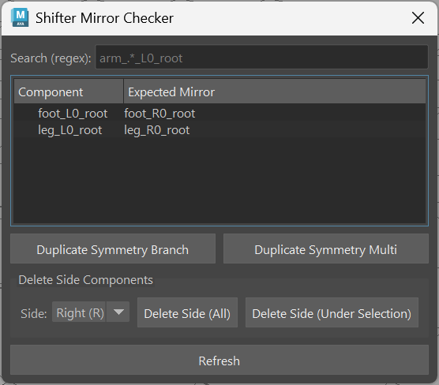

Features
++++++++++++++++++

**Mirror Report**

Generates a report listing all components that are missing their mirror counterpart. This helps identify asymmetries in your guide setup.

**Duplicate Symmetry**

Mirror duplicate functionality for creating symmetric component structures.

- **Duplicate Branch**: Mirror an entire branch of components to the opposite side.
- **Duplicate Multi Components**: Mirror multiple selected components with symmetry.

**Delete Side**

Remove all components on a specific side of the rig.

- **Delete Left (L)**: Remove all components with the "L" (left) side designation.
- **Delete Right (R)**: Remove all components with the "R" (right) side designation.

**Delete Side Under Selection**

Remove side-specific components only beneath the currently selected nodes, preserving components elsewhere in the hierarchy.

**Regex Filtering**

Filter the missing mirrors list using regular expression pattern matching. This is useful for focusing on specific component types or naming patterns.

**Interactive Selection**

Click on items in the list to select the corresponding components in the Maya viewport, making it easy to locate and fix asymmetry issues.

.. _component-type-lister:

Component Type Lister
----------------------

The Component Type Lister is a browser tool that organizes and displays all mGear components in your scene grouped by their component type. This makes it easy to find, select, and manage components across complex rigs.

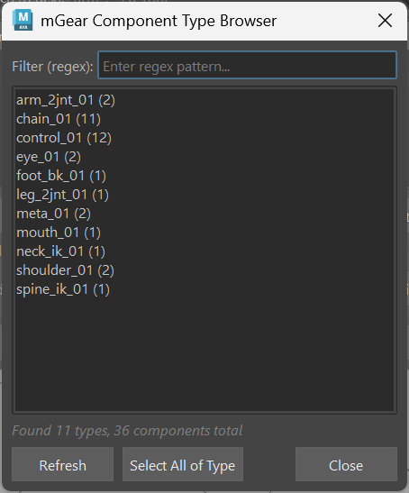

Features
++++++++++++++++++

**Type Discovery**

Automatically scans your scene and identifies all mGear components, organizing them by their ``comp_type`` attribute.

**Type Listing**

Displays a sortable list showing:

- Component type names
- Count of components per type
- Quick visual overview of your rig structure

**Filtering**

Use regex pattern matching to filter the component types displayed. This is helpful when working with large rigs that have many component types.

**Selection**

Click on a component type to select all components of that type in the Maya viewport. This enables quick batch operations on related components.

**Tooltips**

Hover over items to see detailed tooltips showing component names and additional information.

.. _chain-utils:

Chain Utils
------------

Chain Utils provides specialized tools for working with chain components (such as spine chains, tail chains, finger chains, etc.). It simplifies the process of extending chains by adding new locators.

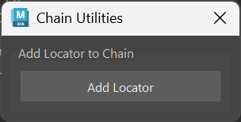

Features
++++++++++++++++++

**Add Locator to Chain**

Extend an existing chain by adding a new locator at the end.

- **Automatic Positioning**: New locators are positioned based on the existing chain direction.
- **Index Increment**: The new locator automatically receives the correct index number.
- **Display Curve Update**: Connection curves are regenerated to include the new locator.

**X-Ray Connection**

For Maya 2022 and later, the tool automatically connects the ``guide_x_ray`` attribute to new locators, maintaining consistent X-ray visualization settings.

**Batch Operations**

Add locators to multiple selected chains simultaneously, saving time when working with symmetric or repeated structures.

How to Use
++++++++++++++++++

1. Select one or more chain guide roots in your scene.
2. Open Chain Utils from **Shifter > Guide Utils > Chain Utils**.
3. Click the button to add a locator to the selected chain(s).
4. The new locator will appear at the end of each chain with proper positioning and naming.

.. _bindplane-control-utils:

BindPlane Control Utils
------------------------

.. note::
    This tool is only available if the bindPlane/bindControl components are installed.

The BindPlane Control Utils provides a browser and property editor for managing bindControl guides. It allows you to organize guides by bind group and edit their properties in batch.

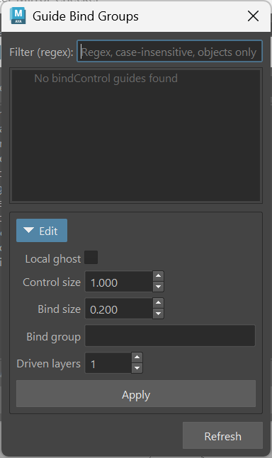

Features
++++++++++++++++++

**Bind Group Browser**

View all bindControl guides in your scene organized by their bind group. The tree view provides a hierarchical display of groups and their associated components.

**Property Editor**

Edit properties of bindControl guides:

- **Control Size**: Adjust the size of the control curves.
- **Bind Size**: Modify the bind influence size.
- **Local Ghost**: Toggle local ghost display.
- **Driven Layers**: Configure driven layer settings.

**Filtering**

Use regex pattern matching to search and filter components by name or group.

**Batch Editing**

Apply property changes to multiple selected guides at once, streamlining the process of configuring large numbers of bindControl components.

.. _game-tools:

Game Tools
==============================================

The Game Tools submenu provides utilities specifically designed for game development workflows, including joint disconnection/reconnection and rig cleanup for export.

Access these tools from the menu: **Shifter > Game Tools**

Disconnect Joints
------------------

Disconnects the rig's deformation joints from the control rig, allowing the joints to be manipulated independently or exported without the rig overhead.

This is useful for:

- Preparing joints for game engine export
- Creating standalone skeletal meshes
- Testing deformation without rig influence

Connect Joints
---------------

Reconnects previously disconnected joints back to the rig using matrix constraints. This restores the rig's control over the deformation joints.

Use this to:

- Re-enable rig control after testing
- Reconnect joints after modifications
- Restore the full rig functionality

Delete Rig + Keep Joints
-------------------------

Removes the entire rig structure while preserving the deformation joints. This is the recommended workflow for creating final game-ready assets.

This operation:

- Deletes all control curves and rig hierarchy
- Preserves the joint chain with current transforms
- Maintains skin weights and connections to geometry
- Creates a clean skeleton ready for export

Game Tool Disconnect + Assembly IO
-----------------------------------

Opens an advanced interface combining joint disconnection tools with Assembly IO functionality for complex game export workflows.

Features include:

- Batch disconnect/reconnect operations
- Assembly-based export configurations
- Custom export presets
- Integration with FBX export pipeline

.. _rig-builder:

Rig Builder
==============================================

The Rig Builder provides an advanced interface for building multiple rigs or managing complex build configurations.

Access from the menu: **Shifter > Rig Builder**

Features
---------

- **Batch Building**: Build multiple rigs in sequence
- **Build Configurations**: Save and load build presets
- **Build Queue**: Manage multiple rig builds
- **Progress Tracking**: Monitor build progress for complex operations
- **Error Handling**: Detailed error reporting for failed builds

.. _guide-template-samples:

Guide Template Samples
==============================================

mGear includes several pre-built guide templates to help you get started quickly with common character types.

Access from the menu: **Shifter > Guide Template Samples**

Biped Templates
----------------

**Biped Template, Y-up**

A standard humanoid biped template oriented for Y-up world axis. Includes:

- Full body with spine, neck, and head
- Arms with FK/IK and roll bones
- Legs with FK/IK, reverse foot, and roll bones
- Fingers and toes

**Game Biped Template, Y-up**

An optimized biped template designed specifically for game engine export with:

- Simplified joint hierarchy
- Game-friendly naming conventions
- Optimized for real-time performance

Quadruped Template
-------------------

**Quadruped Template, Y-up**

A four-legged creature template suitable for animals like dogs, cats, horses, etc. Features:

- Four-leg setup with FK/IK
- Flexible spine chain
- Tail controls
- Head and neck with look-at functionality

Unreal Engine Templates
------------------------

**UE5 MetaHuman/Manny Template, Y-up**

Template matching the UE5 MetaHuman and Manny skeleton structure with Y-up orientation.

**UE5 MetaHuman/Manny Template, Z-up**

Same template with Z-up orientation for direct Unreal compatibility.

**UE4 Mannequin Template, Y-up**

Template matching the classic UE4 Mannequin skeleton with Y-up orientation.

**UE4 Mannequin Template, Z-up**

Same template with Z-up orientation.

**UE MetaHuman/Manny Snap**

Utility to snap an existing guide to match a MetaHuman or Manny skeleton in the scene.

Creature Templates
-------------------

**Spider**

Eight-legged arthropod template with:

- Eight independent leg chains
- Segmented body
- Mandible controls

**Giraffe**

Long-necked quadruped with:

- Extended neck chain
- Four-leg quadruped setup
- Tail controls

**Mantis**

Insect template featuring:

- Six legs with specialized front appendages
- Segmented body
- Wing controls (optional)

**T-Rex**

Bipedal dinosaur template with:

- Two-leg digitigrade setup
- Massive tail chain
- Small arm controls
- Large head with jaw

.. _auto-fit-guide:

Auto Fit Guide
==============================================

Auto Fit Guide provides tools for automatically adjusting guide positions to match existing geometry or joint hierarchies.

Access from the menu: **Shifter > Auto Fit Guide**

Features
---------

- **Geometry Fitting**: Adjust guides to match mesh boundaries
- **Joint Matching**: Snap guides to existing skeleton structures
- **Proportional Adjustment**: Scale guide configurations to match character proportions
- **Batch Processing**: Fit multiple guides simultaneously

.. _mocap-tools:

Mocap Tools
==============================================

The Mocap submenu provides tools for working with motion capture data and HumanIK integration.

Access from the menu: **Shifter > Mocap**

Human IK Mapper
----------------

An advanced tool for mapping mGear rigs to HumanIK definitions, enabling motion capture retargeting and character animation transfer.

Features:

- **Automatic Mapping**: Intelligently maps mGear joints to HumanIK definitions
- **Custom Mapping**: Manual override for non-standard joint configurations
- **Bidirectional Transfer**: Transfer animation to and from HumanIK characters
- **Batch Processing**: Map multiple characters simultaneously

Legacy Mocap Tools
-------------------

.. note::
    These tools are marked as legacy and may be deprecated in future versions.

**Import Mocap Skeleton Biped**

Imports a standard mocap biped skeleton for animation transfer.

**Characterize Biped**

Sets up HumanIK characterization for a biped skeleton.

**Bake Mocap Biped**

Bakes motion capture animation onto the characterized biped.

.. _guide-operations:

Guide Operations
==============================================

These commands provide quick access to common guide manipulation tasks.

Settings
---------

Opens the settings panel for the currently selected guide root or component.

Access from: **Shifter > Settings** or in the Guide Manager

Duplicate
----------

Creates a copy of the selected component with an incremented index number.

- Preserves all component settings
- Maintains parent-child relationships
- Automatically assigns the next available index

Access from: **Shifter > Duplicate**

Duplicate Sym
--------------

Creates a mirrored copy of the selected component on the opposite side.

- Mirrors position and orientation
- Swaps side designation (L to R or R to L)
- Preserves component settings with appropriate mirroring

Access from: **Shifter > Duplicate Sym**

Extract Controls
-----------------

Extracts control shapes from the selected components and stores them as a control buffer.

Use this to:

- Save custom control shapes for reuse
- Transfer control shapes between components
- Create a library of control designs

Access from: **Shifter > Extract Controls**

.. _build-operations:

Build Operations
==============================================

Commands for building rigs from guides and templates.

Build from Selection
---------------------

Builds a rig from the currently selected guide root or components.

- Select a guide root to build the entire rig
- Select specific components to build only those parts
- Respects guide settings for build configuration

Access from: **Shifter > Build from Selection**

Build From Guide Template File
-------------------------------

Opens a file browser to select a guide template file (.sgt) and builds a rig directly from it without importing the guide into the scene first.

This is useful for:

- Rapid rig generation from saved templates
- Automated build pipelines
- Building rigs without modifying the current scene

Access from: **Shifter > Build From Guide Template File**

.. _template-operations:

Template Operations
==============================================

Commands for importing and exporting guide templates.

Import Guide Template
----------------------

Imports a guide template from a file (.sgt) into the current scene.

The imported guide can then be:

- Modified and adjusted
- Built into a rig
- Saved as a new template

Access from: **Shifter > Import Guide Template**

Export Guide Template
----------------------

Exports the selected guide to a template file (.sgt).

Saved templates include:

- All component configurations
- Guide hierarchy structure
- Custom step definitions
- Naming rule settings

Access from: **Shifter > Export Guide Template**

Extract Guide From Rig
-----------------------

Recreates a guide from an existing built rig.

This allows you to:

- Recover a guide if the original was lost
- Modify a rig's underlying structure
- Create a template from a finished rig

Access from: **Shifter > Extract Guide From Rig**

Extract and Match Guide From Rig
---------------------------------

Extracts a guide from a built rig and matches it to the current rig pose.

This is useful for:

- Capturing posed rig configurations
- Creating guides that match specific character poses
- Updating guides to reflect rig modifications

Access from: **Shifter > Extract and Match Guide From Rig**

Match Guide to Selected Joint Hierarchy
----------------------------------------

Snaps the guide positions to match a selected joint hierarchy in the scene.

Use this to:

- Align guides to imported skeletons
- Match guides to existing character rigs
- Quickly position guides based on reference joints

Access from: **Shifter > Match Guide to Selected Joint Hierarchy**

.. _maintenance-tools:

Maintenance Tools
==============================================

Utilities for maintaining and updating your Shifter setup.

Update Guide
-------------

Updates an existing guide to the latest component versions and structure.

This is useful when:

- Upgrading to a new mGear version
- Components have been updated with new features
- Guide structure needs to be refreshed

Access from: **Shifter > Update Guide**

Reload Components
------------------

Reloads all Shifter components from disk.

Use this when:

- You've modified component source code
- New components have been added to the system
- Components need to be refreshed without restarting Maya

Access from: **Shifter > Reload Components**

.. _data-centric-folders:

Data-Centric Folders Creator
==============================================

A utility tool for creating standardized folder structures for data-centric rigging workflows.

Access from: **Shifter > Data-Centric Folders Creator**

Features
---------

- **Template-Based Structure**: Create folder hierarchies from predefined templates
- **Custom Configuration**: Define your own folder structure layouts
- **Project Integration**: Set up folders that integrate with your pipeline
- **Batch Creation**: Create multiple folder structures at once

Standard Folder Structure
--------------------------

The tool creates organized folders for:

- Guide templates
- Custom steps
- Control shapes
- Skin weights
- Build configurations
- Export presets

.. _build-log:

Build Log
==============================================

The Build Log submenu provides tools for monitoring and debugging the rig build process.

Access from: **Shifter > Build Log**

Toggle Log
-----------

Enables or disables mGear's logging system.

When enabled:

- Build progress is logged to the Script Editor
- Warnings and errors are captured
- Performance metrics may be recorded

Toggle Debug Mode
------------------

Enables or disables debug mode for detailed build information.

Debug mode provides:

- Verbose output during build
- Detailed error messages
- Component-level build information
- Performance profiling data

Shifter Log Window
-------------------

Opens a dedicated log window for monitoring Shifter operations.

Features:

- Real-time build progress
- Filterable log messages
- Error highlighting
- Export log to file