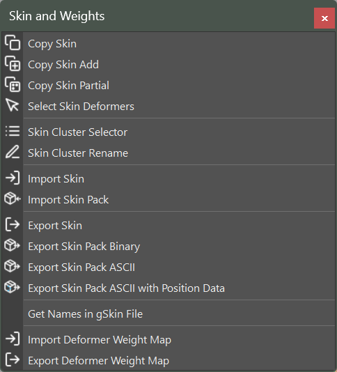

Skin and Weights User Documentation
####################################

Skin and Weights is a collection of tools for managing skin clusters, transferring skin weights, and importing/exporting skinning data. These tools streamline common skinning workflows and support both binary and human-readable file formats.

Access these tools from the menu: **mGear > Skin and Weights**

Copy Skin
=========

Copy the complete skin cluster from a source mesh to a target mesh.

**Usage:**

1. Select the source mesh (the one with the skin cluster you want to copy)
2. Select the target mesh (add it to the selection)
3. Run **Copy Skin**

The tool uses Maya's ``copySkinWeights`` with one-to-one influence association to transfer all weights from source to target. If the target mesh does not have a skin cluster, one is created automatically with the same influences as the source.

Copy Skin Add
=============

Stack a new skin cluster on top of an existing one, preserving previous skinning layers.

**Usage:**

1. Select the source mesh
2. Select the target mesh (must already have a skin cluster)
3. Run **Copy Skin Add**

This is useful when you need to layer multiple skin cluster passes on the same geometry. The previous skin output is preserved and the new skin cluster is added on top.

Copy Skin Partial
=================

Copy skin weights to selected vertices only, without affecting the rest of the mesh.

**Usage:**

1. Select the source mesh
2. Select the target vertices you want to update
3. Run **Copy Skin Partial**

A dialog appears with the following options:

* **Source Mesh**: Click the arrow button to load the source mesh from your selection.
* **Normalize**: When enabled, normalizes the weights after copying.

This tool uses closest-point matching to find the corresponding source vertex for each selected target vertex, making it ideal for fixing specific areas without a full skin copy.

Select Skin Deformers
=====================

Select all joints and influences that are part of a mesh's skin cluster.

**Usage:**

1. Select a skinned mesh
2. Run **Select Skin Deformers**

All joints influencing the selected mesh will be selected in the viewport. This is useful for quickly identifying which joints drive a particular mesh.

Skin Cluster Selector
=====================

A dockable UI for viewing and managing skin clusters on an object.

**Usage:**

1. Select a mesh
2. Run **Skin Cluster Selector**

The dialog lists all skin clusters connected to the selected object, including chained skin clusters. This is especially useful for meshes with multiple stacked skin clusters.

* **LMB click** on a skin cluster to select it
* **RMB click** to open the context menu:

  * **Turn ON**: Enable the skin cluster envelope
  * **Turn OFF**: Disable the skin cluster envelope

Disabled skin clusters appear in red, active ones in the default color.

Skin Cluster Rename
===================

Rename all skin clusters on the selected objects to follow a standard naming convention.

**Usage:**

1. Select one or more skinned meshes
2. Run **Skin Cluster Rename**

Each skin cluster is renamed to ``objectName_skinCluster``. This keeps your scene organized and makes it easier to identify which skin cluster belongs to which mesh.

Import Skin
============

Import skin weights from a ``.gSkin`` (binary) or ``.jSkin`` (JSON) file.

**Usage:**

1. Run **Import Skin**
2. Browse to the skin file
3. Weights are applied to the matching object in the scene

The import process:

* Finds the matching object in the scene by name (stored in the file)
* Creates a skin cluster if the object does not have one
* Adds any missing joint influences automatically
* Applies the saved weights

**Vertex Count Mismatch Handling:**

If the file was exported from geometry with a different vertex count, the importer automatically falls back to a volume-based method. This uses vertex world positions (if stored in the file) or closest-point matching to map weights from the source topology to the target.

.. note::

    For best results when dealing with topology changes, export your skin files with position data using **Export Skin Pack ASCII with Position Data**.

Import Skin Pack
================

Import multiple skin files at once from a ``.gSkinPack`` manifest file.

**Usage:**

1. Run **Import Skin Pack**
2. Browse to the ``.gSkinPack`` file
3. All referenced skin files are imported

A skin pack is a directory containing individual skin files along with a manifest that lists them. This is the recommended approach for importing skin weights for an entire character.

.. tip::

    Skin packs are commonly used with Shifter's custom step system to automatically restore skin weights after a rig rebuild.

Export Skin
===========

Export skin cluster data from selected meshes to a file.

**Usage:**

1. Select one or more skinned meshes
2. Run **Export Skin**
3. Choose a save location and file name

The file stores all skin cluster data including joint influences, per-vertex weights, dual quaternion blend weights, skinning method, and normalize settings.

Export Skin Pack Binary
=======================

Export skin data for multiple meshes as a binary skin pack.

**Usage:**

1. Select all skinned meshes to export
2. Run **Export Skin Pack Binary**
3. Choose a save location

This creates a ``.gSkinPack`` manifest file along with individual ``.gSkin`` binary files for each selected mesh. Binary files are smaller but not human-readable.

Export Skin Pack ASCII
======================

Export skin data for multiple meshes as a JSON skin pack.

**Usage:**

1. Select all skinned meshes to export
2. Run **Export Skin Pack ASCII**
3. Choose a save location

This creates a ``.gSkinPack`` manifest file along with individual ``.jSkin`` JSON files for each selected mesh. JSON files are larger but human-readable and version-control friendly.

Export Skin Pack ASCII with Position Data
=========================================

Export a JSON skin pack that includes vertex world positions for each mesh.

**Usage:**

1. Select all skinned meshes to export
2. Run **Export Skin Pack ASCII with Position Data**
3. Choose a save location

This is the same as **Export Skin Pack ASCII** but additionally stores the world-space position of every vertex. This position data enables the volume-based import method when the target geometry has a different vertex count than the original.

.. note::

    Files exported with position data are larger due to the extra coordinate information. Use this option when you anticipate topology changes between export and import.

Get Names in gSkin File
=======================

Inspect a skin file and print the object names stored inside it to the Maya script editor.

**Usage:**

1. Run **Get Names in gSkin File**
2. Browse to a ``.gSkin`` or ``.jSkin`` file

The names of all objects contained in the file are printed to the script editor output. This is useful for verifying file contents without performing a full import.

Import Deformer Weight Map
==========================

Import deformer weight maps from a ``.wmap`` file.

**Usage:**

1. Select a deformer node
2. Run **Import Deformer Weight Map**
3. Browse to the ``.wmap`` file

Weight maps are restored to the selected deformer. This works with any Maya deformer that has a weight map, including wire deformers, clusters, and lattices.

Export Deformer Weight Map
==========================

Export deformer weight maps to a ``.wmap`` file.

**Usage:**

1. Select a deformer node
2. Run **Export Deformer Weight Map**
3. Choose a save location

The per-vertex weights of the selected deformer are saved as a JSON file. This is useful for backing up and transferring non-skin deformer weights.

File Formats
============

mGear uses several file formats for storing skinning and weight data.

.gSkin (Binary)
----------------

Binary skin file using Python's pickle serialization. Stores joint influences, per-vertex weights, blend weights, skinning method, and normalize settings. Compact but not human-readable.

.jSkin (JSON)
--------------

JSON skin file with the same data as ``.gSkin`` but in a human-readable text format. Larger than binary but suitable for version control and manual inspection.

.gSkinPack (Manifest)
----------------------

A JSON manifest file that references a collection of individual skin files. Used by **Import Skin Pack** and **Export Skin Pack** to handle multiple meshes at once. The manifest and skin files are stored together in the same directory.

Example directory structure::

    character_skin/
        character_skin.gSkinPack
        body_geo.jSkin
        head_geo.jSkin
        hands_geo.jSkin

.wmap (Weight Map)
-------------------

A JSON file storing per-vertex deformer weight maps for non-skin deformers such as wire deformers, clusters, and lattices.