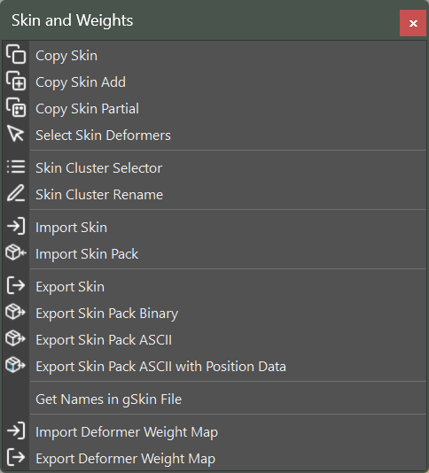

Skin and Weights User Documentation
####################################

Skin and Weights is a collection of tools for managing skin clusters, transferring skin weights, and importing/exporting skinning data. These tools streamline common skinning workflows and support both binary and human-readable file formats.

Access these tools from the menu: **mGear > Skin and Weights**

Copy Skin
=========

Copy the complete skin cluster from a source mesh to a target mesh.

**Usage:**

1. Select the source mesh (the one with the skin cluster you want to copy)
2. Select the target mesh (add it to the selection)
3. Run **Copy Skin**

The tool uses Maya's ``copySkinWeights`` with one-to-one influence association to transfer all weights from source to target. If the target mesh does not have a skin cluster, one is created automatically with the same influences as the source.

Copy Skin Add
=============

Stack a new skin cluster on top of an existing one, preserving previous skinning layers.

**Usage:**

1. Select the source mesh
2. Select the target mesh (must already have a skin cluster)
3. Run **Copy Skin Add**

This is useful when you need to layer multiple skin cluster passes on the same geometry. The previous skin output is preserved and the new skin cluster is added on top.

Copy Skin Partial
=================

Copy skin weights to selected vertices only, without affecting the rest of the mesh.

**Usage:**

1. Select the source mesh
2. Select the target vertices you want to update
3. Run **Copy Skin Partial**

A dialog appears with the following options:

* **Source Mesh**: Click the arrow button to load the source mesh from your selection.
* **Normalize**: When enabled, normalizes the weights after copying.

This tool uses closest-point matching to find the corresponding source vertex for each selected target vertex, making it ideal for fixing specific areas without a full skin copy.

**Soft selection support**

When Maya's soft selection is enabled (``B`` key), the tool automatically expands the working set to include every vertex inside the falloff region — you do not need to manually select them. Each vertex's falloff value (0–1) is read from the active rich selection and used to **linearly blend** the copied weights with the vertex's existing weights:

* Vertices at the center of the selection (falloff = 1.0) receive the **full copied weight** (100% replacement).
* Vertices at the edge of the falloff (falloff ≈ 0.0) keep weights very close to their original.
* Everything in between is a smooth, proportional blend.

The result is a continuous gradient out from the click point instead of a hard seam at the selection boundary.

The hard selection still defines **which meshes** are touched: only meshes that contain at least one explicitly selected vertex are processed, even if soft falloff happens to reach a neighboring mesh.

Hard selection (soft select off) behaves exactly as before: every explicitly selected vertex is fully replaced with the copied weights and nothing else is touched.

**Scripted use**

.. code-block:: python

    from mgear.core import skin

    # Honors current soft-selection state by default.
    skin.skinCopyPartial(sourceMesh="body_geo")

    # Force a hard copy regardless of soft-select state.
    skin.skinCopyPartial(sourceMesh="body_geo", soft_select=False)

Select Skin Deformers
=====================

Select all joints and influences that are part of a mesh's skin cluster.

**Usage:**

1. Select a skinned mesh
2. Run **Select Skin Deformers**

All joints influencing the selected mesh will be selected in the viewport. This is useful for quickly identifying which joints drive a particular mesh.

Skin Cluster Selector
=====================

A dockable UI for viewing and managing skin clusters on an object.

**Usage:**

1. Select a mesh
2. Run **Skin Cluster Selector**

The dialog lists all skin clusters connected to the selected object, including chained skin clusters. This is especially useful for meshes with multiple stacked skin clusters.

* **LMB click** on a skin cluster to select it
* **RMB click** to open the context menu:

  * **Turn ON**: Enable the skin cluster envelope
  * **Turn OFF**: Disable the skin cluster envelope

Disabled skin clusters appear in red, active ones in the default color.

Skin Cluster Rename
===================

Rename all skin clusters on the selected objects to follow a standard naming convention.

**Usage:**

1. Select one or more skinned meshes
2. Run **Skin Cluster Rename**

Each skin cluster is renamed to ``objectName_skinCluster``. This keeps your scene organized and makes it easier to identify which skin cluster belongs to which mesh.

Import Skin
============

Import skin weights from a ``.gSkin`` (binary) or ``.jSkin`` (JSON) file.

**Usage:**

1. Run **Import Skin**
2. Browse to the skin file
3. Weights are applied to the matching object in the scene

The import process:

* Finds the matching object and joints in the scene by name (stored in the file), whatever their namespace
* Creates a skin cluster if the object does not have one
* Adds any missing joint influences automatically
* Applies the saved weights

**Namespaces and Clashing Names:**

Objects and joints are matched even when the namespace differs between export and import, for example weights exported from a referenced rig (``char:body``) and imported into the rig file (``body``), or the other way around. When several objects share a short name (``grpA|body`` and ``grpB|body``), the full DAG path stored in the file picks the right one.

**Remap Dialog:**

When an object or joint can't be resolved, the menu and drag-and-drop imports open the **Skin Import Remap** dialog, once per skin file:

* **Geometry** tab: one row per missing or ambiguous object, set to **Skip** by default. The target list shows the scene objects with the same name or, when there are none, objects with a similar name. Each entry shows its point (vertex or CV) count; objects with the same point count as the exported one come first and are marked with ✓. The **...** button next to the list opens a list of every mesh, NURBS surface and curve in the scene, with a name filter and a **Same point count only** option, so you can pick any object while the dialog is open.

  .. image:: images/skinning/skin_import_remap_geo.png
      :align: center

* **Joints** tab: all the missing joints of the file in one table. Pick a target from the list or type its name, or use the match tools. The tools run on the selected rows, or on all rows when none are selected. Rows where the tool finds a match get the proposed joint (replacing a previous choice); the other rows keep their target. The viewport message shows how many rows matched:

  * **Search/Replace**: replaces text in each exported joint name and proposes the scene joint whose name is exactly the result (see the examples below)
  * **Prefix**: strip and/or add a name prefix (see the examples below)
  * **L <-> R**: swap side tokens, using the same rules as the mGear mirror tools
  * **Similar name**: closest name whose similarity is at least the **Similarity** value, from 0 to 1. ``1.0`` only accepts identical names; the default ``0.80`` accepts small differences such as ``spine_C0_jnt`` and ``spine_C0_0_jnt``. Lower values accept looser matches with more risk of a wrong pick
  * **Closest position**: joint at the same bind-pose position, within the **Tolerance** distance in world units. Needs skin files that store the joint bind positions; re-export older files to enable it.

  The candidates can be the influences of the target skin cluster, all scene joints, or the joints under the selected root. **Apply** is enabled when every joint has a target; **Skip unresolved** applies what is set and skips the rest.

  .. image:: images/skinning/skin_import_remap_joint.png
      :align: center

**Search/Replace Examples:**

The tools work on the joint name without its namespace, and only propose a joint when the result is exactly the name of one candidate joint. Without **Regex**, the search text is replaced literally, everywhere it appears in the name:

==============  ===========  ==========================  ==========================
Search          Replace      Exported joint              Proposed joint
==============  ===========  ==========================  ==========================
``_L0_``        ``_L1_``     ``arm_L0_3_jnt``            ``arm_L1_3_jnt``
``_jnt``        ``_JNT``     ``spine_C0_1_jnt``          ``spine_C0_1_JNT``
``neck``        ``head``     ``neck_C0_0_jnt``           ``head_C0_0_jnt``
==============  ===========  ==========================  ==========================

With **Regex** checked, the search is a Python regular expression and the replacement can use the matched groups (``\1``, ``\2``...). There are no ``*`` wildcards: use ``.*`` (any text) or ``.+`` (at least one character) instead.

=========================  ===============  ==========================  ==========================
Search (regex)             Replace          Exported joint              Proposed joint
=========================  ===============  ==========================  ==========================
``_s(\d+)_``               ``_\1_``         ``arm_L0_s1_jnt``           ``arm_L0_1_jnt``
``^[^_]+_``                (empty)          ``old_spine_C0_jnt``        ``spine_C0_jnt``
``_\d+_jnt$``              ``_jnt``         ``finger_L0_2_jnt``         ``finger_L0_jnt``
``^(.*)_jnt$``             ``\1_bone``      ``leg_R0_knee_jnt``         ``leg_R0_knee_bone``
``(?i)JNT$``               ``jnt``          ``hand_L0_JNT``             ``hand_L0_jnt``
=========================  ===============  ==========================  ==========================

* ``\d+`` is one or more digits, ``[^_]+`` is text up to the first underscore, ``^`` and ``$`` are the start and end of the name, and ``(?i)`` makes the search ignore case.
* To try a pattern on a few joints first, select those rows; with no rows selected the tool runs on every row.

**Prefix Examples:**

**Strip prefix** removes the text from the start of the name, if it is there, then **Add prefix** is added. Either field can be empty.

==============  ==============  ==========================  ==========================
Strip prefix    Add prefix      Exported joint              Proposed joint
==============  ==============  ==========================  ==========================
``old_``        (empty)         ``old_spine_C0_jnt``        ``spine_C0_jnt``
(empty)         ``char_``       ``spine_C0_jnt``            ``char_spine_C0_jnt``
``L_``          ``left_``       ``L_hand_jnt``              ``left_hand_jnt``
``rig_``        ``def_``        ``rig_neck_C0_jnt``         ``def_neck_C0_jnt``
==============  ==============  ==========================  ==========================

Namespaces don't need a prefix: they are already ignored when matching, and the **Candidates** list shows joints from every namespace.

* If you pick a target object whose joints don't match either, the dialog opens again for the same file with only those joints.
* **Save mapping...** writes every choice made so far in the import to a ``.gSkinMap`` file: the choices from earlier dialogs (earlier files of a skin pack, or a first round of the same file) plus the current one. Once saved, the file is updated each time you click **Apply** or **Skip unresolved** in a later dialog of the same import, or load a mapping (the dialog shows *Updating <file>*). Save on the first dialog of a skin pack and the file ends up holding the remap of the whole pack. **Skip this file** and **Cancel import** don't add that dialog's rows to it.
* **Load mapping...** fills the rows from a ``.gSkinMap`` file and also uses it for the remaining files of the import, so loading it once covers the whole skin pack.
* **Skip this file** and **Cancel import** control the rest of a skin pack import.

**Scripting:**

.. code-block:: python

    from mgear.core import skin

    # Default: unresolved objects and joints are skipped with a warning
    skin.importSkinPack(path)

    # Builds: fail before applying any weights if something is missing
    skin.importSkinPack(path, on_missing="error", mapping="char.gSkinMap")

    # Force a namespace ("" for the root namespace)
    skin.importSkin(path, namespace="char:")

``on_missing`` accepts ``"skip"`` (default), ``"error"`` (raises ``skin.SkinRemapError``), ``"ui"`` (remap dialog) or a function that receives the ``skin.SkinRemapReport`` and returns a mapping (``{"geometry": {...}, "influences": {...}}``) or ``None`` to cancel.

**Vertex Count Mismatch Handling:**

If the file was exported from geometry with a different vertex count, the importer automatically falls back to a volume-based method. This uses vertex world positions (if stored in the file) or closest-point matching to map weights from the source topology to the target.

.. note::

    For best results when dealing with topology changes, export your skin files with position data using **Export Skin Pack ASCII with Position Data**.

Import Skin Pack
================

Import multiple skin files at once from a ``.gSkinPack`` manifest file.

**Usage:**

1. Run **Import Skin Pack**
2. Browse to the ``.gSkinPack`` file
3. All referenced skin files are imported

Each skin file is resolved and applied on its own. The remap dialog opens only for files with missing items, and the choices made for one file are reused for the next ones. With ``on_missing="error"``, every file is checked before any weights are applied.

A skin pack is a directory containing individual skin files along with a manifest that lists them. This is the recommended approach for importing skin weights for an entire character.

.. tip::

    Skin packs are commonly used with Shifter's custom step system to automatically restore skin weights after a rig rebuild.

Export Skin
===========

Export skin cluster data from selected meshes to a file.

**Usage:**

1. Select one or more skinned meshes
2. Run **Export Skin**
3. Choose a save location and file name

The file stores all skin cluster data including joint influences, per-vertex weights, dual quaternion blend weights, skinning method, and normalize settings.

Export Skin Pack Binary
=======================

Export skin data for multiple meshes as a binary skin pack.

**Usage:**

1. Select all skinned meshes to export
2. Run **Export Skin Pack Binary**
3. Choose a save location

This creates a ``.gSkinPack`` manifest file along with individual ``.gSkin`` binary files for each selected mesh. Binary files are smaller but not human-readable.

Skin file names keep the namespace and path of the object, with ``:`` written as ``.`` and ``|`` as ``-`` (``char.body.gSkin``, ``grpA-body.gSkin``), so objects with the same short name don't overwrite each other.

Export Skin Pack ASCII
======================

Export skin data for multiple meshes as a JSON skin pack.

**Usage:**

1. Select all skinned meshes to export
2. Run **Export Skin Pack ASCII**
3. Choose a save location

This creates a ``.gSkinPack`` manifest file along with individual ``.jSkin`` JSON files for each selected mesh. JSON files are larger but human-readable and version-control friendly.

Export Skin Pack ASCII with Position Data
=========================================

Export a JSON skin pack that includes vertex world positions for each mesh.

**Usage:**

1. Select all skinned meshes to export
2. Run **Export Skin Pack ASCII with Position Data**
3. Choose a save location

This is the same as **Export Skin Pack ASCII** but additionally stores the world-space position of every vertex. This position data enables the volume-based import method when the target geometry has a different vertex count than the original.

.. note::

    Files exported with position data are larger due to the extra coordinate information. Use this option when you anticipate topology changes between export and import.

Get Names in gSkin File
=======================

Inspect a skin file and print the object names stored inside it to the Maya script editor.

**Usage:**

1. Run **Get Names in gSkin File**
2. Browse to a ``.gSkin`` or ``.jSkin`` file

The names of all objects contained in the file are printed to the script editor output. This is useful for verifying file contents without performing a full import.

Import Deformer Weight Map
==========================

Import deformer weight maps from a ``.wmap`` file.

**Usage:**

1. Select a deformer node
2. Run **Import Deformer Weight Map**
3. Browse to the ``.wmap`` file

Weight maps are restored to the selected deformer. This works with any Maya deformer that has a weight map, including wire deformers, clusters, and lattices.

Export Deformer Weight Map
==========================

Export deformer weight maps to a ``.wmap`` file.

**Usage:**

1. Select a deformer node
2. Run **Export Deformer Weight Map**
3. Choose a save location

The per-vertex weights of the selected deformer are saved as a JSON file. This is useful for backing up and transferring non-skin deformer weights.

File Formats
============

mGear uses several file formats for storing skinning and weight data.

.gSkin (Binary)
----------------

Binary skin file using Python's pickle serialization. Stores joint influences, per-vertex weights, blend weights, skinning method, and normalize settings. Compact but not human-readable.

.jSkin (JSON)
--------------

JSON skin file with the same data as ``.gSkin`` but in a human-readable text format. Larger than binary but suitable for version control and manual inspection.

.gSkinPack (Manifest)
----------------------

A JSON manifest file that references a collection of individual skin files. Used by **Import Skin Pack** and **Export Skin Pack** to handle multiple meshes at once. The manifest and skin files are stored together in the same directory.

Example directory structure::

    character_skin/
        character_skin.gSkinPack
        body_geo.jSkin
        head_geo.jSkin
        hands_geo.jSkin

.gSkinMap (Remap)
------------------

A JSON file that maps the object and joint names stored in skin files to the objects and joints of the current scene. It is written by **Save mapping...** in the Skin Import Remap dialog (with every choice made during that import, see above) and read by **Load mapping...**, or passed to ``importSkin`` / ``importSkinPack`` with ``mapping=`` so builds can reuse an interactive remap without any dialog.

Example::

    {
        "geometry": {
            "geo_root|geo_body_00_MMM": "|geo_root|geo_body_01_MMM",
            "char:geo_hair_00_MMM": "|geo_root|geo_hair_00_MMM"
        },
        "influences": {
            "arm_L0_3_jnt": "|rig|arm_L0_3_jnt",
            "arm_L0_s1_jnt": "arm_L0_1_jnt"
        },
        "version": 1
    }

* ``geometry``: exported object name, as stored in the skin file (it can include a namespace or a ``|`` path), mapped to the scene object.
* ``influences``: exported joint name, without namespace, mapped to the scene joint.
* The scene names can be full DAG paths (what the dialog saves) or any name that is unique in the scene. A name that is missing or not unique is ignored, and the normal automatic matching is used for it.
* Both sections are optional, so a hand-written mapping can list only the names that need it.
* Names that the mapping doesn't list are still matched automatically, so the mapping only needs the renamed or ambiguous items.

.wmap (Weight Map)
-------------------

A JSON file storing per-vertex deformer weight maps for non-skin deformers such as wire deformers, clusters, and lattices.