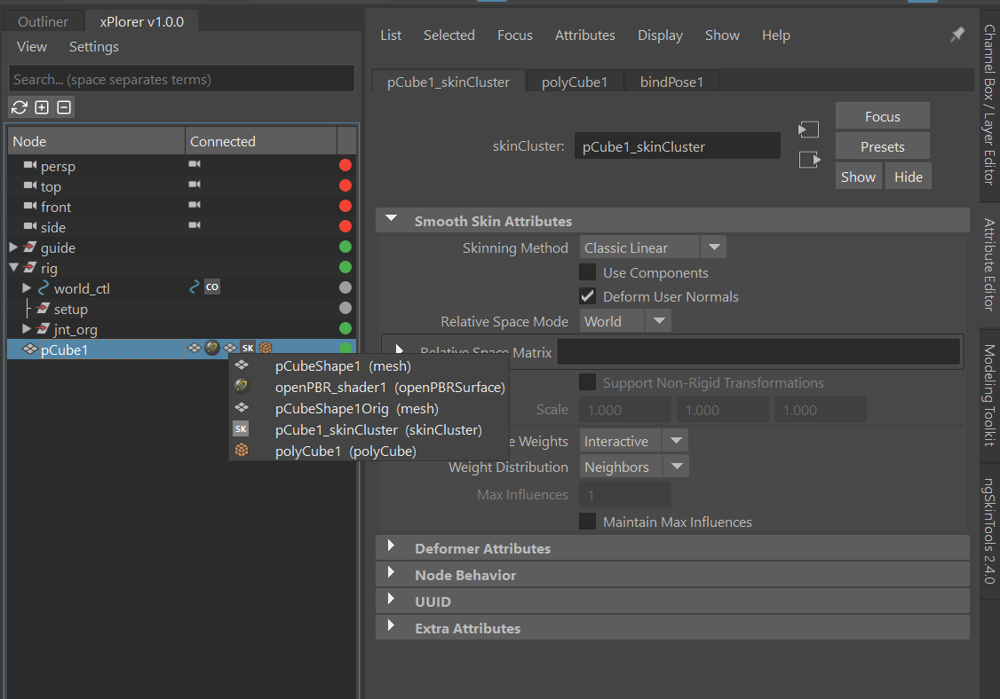
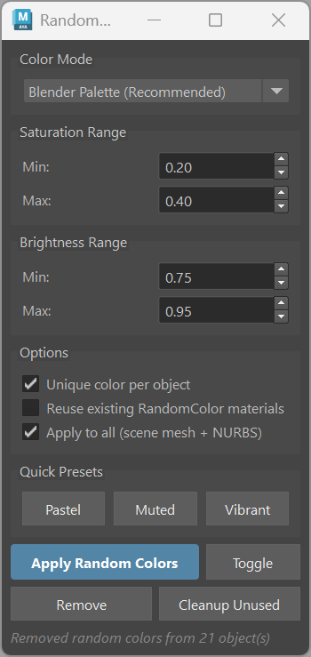

UtilBits User Documentation
###########################

UtilBits is a collection of general-purpose utility tools for Maya that help streamline common tasks in your workflow. These tools are designed to improve productivity and make everyday operations more efficient.

Access these tools from the menu: **mGear > Utilbits**

.. image:: images/utilbits/utilBits_menu.png
    :align: center

.. _xplorer:

xPlorer
=======

xPlorer is a comprehensive DAG (Directed Acyclic Graph) and DG (Dependency Graph) browser and explorer for Maya. It provides an interactive way to navigate, search, and manage your scene hierarchy with advanced filtering and display options. xPlorer also enables quick access to Attribute Editor pages for any node, making it an essential tool for navigating complex scenes and node networks.

Features
--------

**Interactive Tree View**

Browse your scene hierarchy in an intuitive tree view with lazy loading for optimal performance.

- **Multi-column Display**: Shows node names, connected nodes, and visibility states
- **Lazy Loading**: Nodes are loaded on-demand as you expand the tree, keeping the interface responsive even in complex scenes

**Search and Filtering**

Quickly find nodes in your scene with powerful search capabilities.

- **Real-time Search**: Results update as you type with debouncing for smooth performance
- **Load All Nodes**: Option to load the complete hierarchy for comprehensive searching
- **Search Limits**: Configurable result limits (25, 50, 100, 200, 500, or unlimited) for performance control
- **Search Listed Only**: Option to search only within currently visible nodes
- **List Selected Only**: Filter the tree to show only selected objects

**Display Options**

Customize how nodes are displayed in the tree.

- **Show/Hide Shapes**: Toggle visibility of shape nodes in the hierarchy
- **Auto-adjust Node Column**: Automatically resize the node name column to fit content
- **Stretch Connected Column**: Expand the connected nodes column to fill available space

**Connected Nodes Widget**

View related nodes for any selected object, providing quick access to the Dependency Graph connections.

- **Shapes**: Display shape nodes associated with transform nodes
- **Shaders**: Show materials and shading groups connected to the object
- **Deformers**: List deformers affecting the geometry
- **Constraints**: Display constraints applied to the node
- **Quick Navigation**: Click on any connected node to navigate to it and open its Attribute Editor page

**Visibility Management**

Quickly toggle and manage object visibility.

- **Visual Indicators**: Green, red, and gray dots indicate visible, hidden, and locked visibility states
- **Quick Toggle**: Click to toggle visibility directly from the tree view

**Selection Synchronization**

Keep Maya's selection in sync with the xPlorer tree.

- **Bidirectional Sync**: Selecting in xPlorer updates Maya selection and vice versa

**Quick Attribute Editor Access**

Rapidly open Attribute Editor pages for any node in your scene.

- **Middle-click**: Opens the Attribute Editor with a dedicated tab for the clicked node, allowing you to quickly inspect and modify attributes without losing your current Attribute Editor tabs
- **DG Node Access**: Navigate to connected DG nodes (shaders, deformers, constraints) and instantly open their Attribute Editor pages

**Keyboard Shortcuts**

- **F**: Frame selected node in the tree
- **Ctrl+R**: Refresh the tree view

**Context Menus**

Right-click on nodes to access additional options.

- **Copy Node Name**: Copy the short name of the node to clipboard
- **Copy Full Path**: Copy the complete DAG path to clipboard

.. _random-colors:

Random Colors
=============

Random Colors is a tool for quickly assigning random muted or pastel colors to selected mesh objects. It creates OpenPBR (standardSurface) shaders with randomized colors, making it easy to visually distinguish objects in your scene.

Features
--------

**Color Generation Modes**

Choose from multiple color generation algorithms to achieve different visual styles.

- **Blender Palette (Recommended)**: Uses predefined hues with pastel variations for a cohesive look
- **Fully Random**: Generates any hue with muted saturation for varied results
- **Complementary Harmony**: Creates colors based on color theory complementary relationships
- **Triadic Harmony**: Generates three harmonious colors evenly spaced on the color wheel
- **Analogous Harmony**: Produces colors adjacent to each other on the color wheel for subtle variation

**Saturation and Brightness Control**

Fine-tune the color output with adjustable parameters.

- **Saturation Range**: Control how vivid or muted the generated colors appear
- **Brightness Range**: Adjust the lightness of the generated colors

**Quick Presets**

Apply common color styles with one click.

- **Pastel**: Light, soft colors with low saturation
- **Muted**: Subdued colors with moderate saturation
- **Vibrant**: Bold, saturated colors for high contrast

**Color Application Options**

Control how colors are assigned to objects.

- **Unique Colors**: Generate a different color for each selected object
- **Reuse Single Color**: Apply the same random color to all selected objects

**Material Management**

Tools for managing RandomColor materials in your scene.

- **Create and Apply**: Automatically create new OpenPBR shaders and assign them to selected objects
- **Remove Materials**: Remove RandomColor materials from selected objects
- **Cleanup**: Delete unused RandomColor materials from the scene

**Shader Properties**

RandomColor creates standardSurface shaders with configurable properties.

- **Base Color**: The randomly generated color
- **Specularity**: Reflective properties of the material
- **Roughness**: Surface roughness for realistic shading

**Undo Support**

All operations support Maya's undo system, allowing you to easily revert changes.
