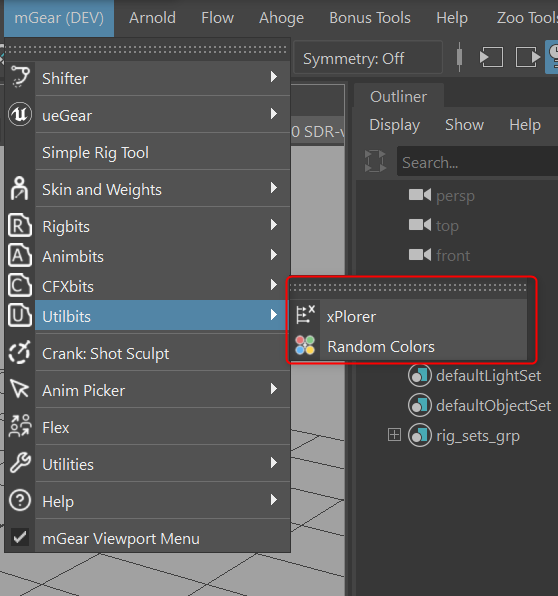
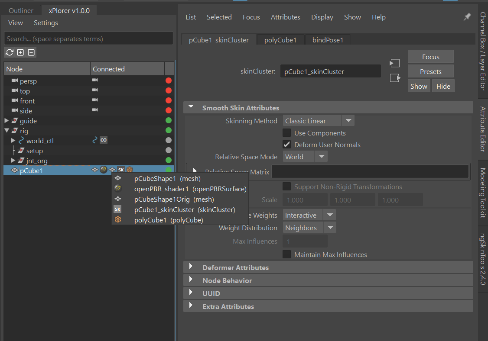
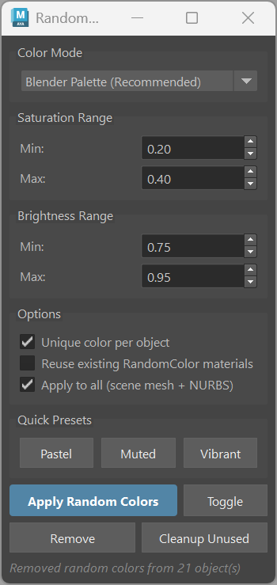
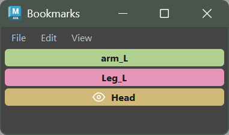
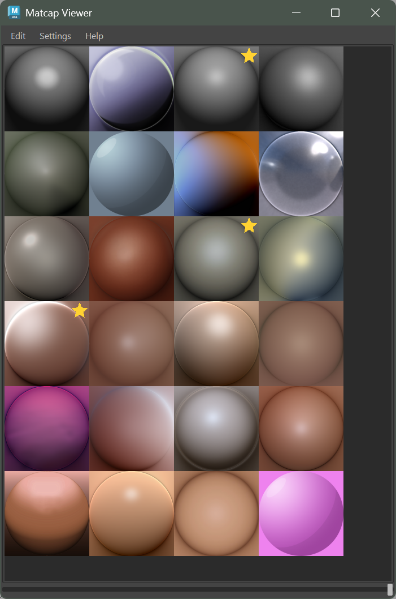
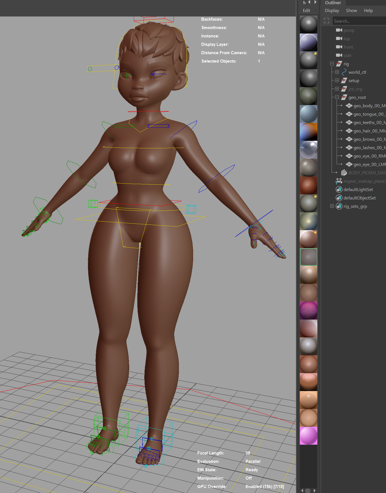

UtilBits User Documentation
###########################

UtilBits is a collection of general-purpose utility tools for Maya that help streamline common tasks in your workflow. These tools are designed to improve productivity and make everyday operations more efficient.

Access these tools from the menu: **mGear > Utilbits**

.. _xplorer:

xPlorer
=======

xPlorer is a comprehensive DAG (Directed Acyclic Graph) and DG (Dependency Graph) browser and explorer for Maya. It provides an interactive way to navigate, search, and manage your scene hierarchy with advanced filtering and display options. xPlorer also enables quick access to Attribute Editor pages for any node, making it an essential tool for navigating complex scenes and node networks.

Features
--------

**Interactive Tree View**

Browse your scene hierarchy in an intuitive tree view with lazy loading for optimal performance.

- **Multi-column Display**: Shows node names, connected nodes, and visibility states
- **Lazy Loading**: Nodes are loaded on-demand as you expand the tree, keeping the interface responsive even in complex scenes

**Search and Filtering**

Quickly find nodes in your scene with powerful search capabilities.

- **Real-time Search**: Results update as you type with debouncing for smooth performance
- **Load All Nodes**: Option to load the complete hierarchy for comprehensive searching
- **Search Limits**: Configurable result limits (25, 50, 100, 200, 500, or unlimited) for performance control
- **Search Listed Only**: Option to search only within currently visible nodes
- **List Selected Only**: Filter the tree to show only selected objects

**Display Options**

Customize how nodes are displayed in the tree.

- **Show/Hide Shapes**: Toggle visibility of shape nodes in the hierarchy
- **Auto-adjust Node Column**: Automatically resize the node name column to fit content
- **Stretch Connected Column**: Expand the connected nodes column to fill available space

**Connected Nodes Widget**

View related nodes for any selected object, providing quick access to the Dependency Graph connections.

- **Shapes**: Display shape nodes associated with transform nodes
- **Shaders**: Show materials and shading groups connected to the object
- **Deformers**: List deformers affecting the geometry
- **Constraints**: Display constraints applied to the node
- **Quick Navigation**: Click on any connected node to navigate to it and open its Attribute Editor page

**Visibility Management**

Quickly toggle and manage object visibility.

- **Visual Indicators**: Green, red, and gray dots indicate visible, hidden, and locked visibility states
- **Quick Toggle**: Click to toggle visibility directly from the tree view

**Selection Synchronization**

Keep Maya's selection in sync with the xPlorer tree.

- **Bidirectional Sync**: Selecting in xPlorer updates Maya selection and vice versa

**Quick Attribute Editor Access**

Rapidly open Attribute Editor pages for any node in your scene.

- **Middle-click**: Opens the Attribute Editor with a dedicated tab for the clicked node, allowing you to quickly inspect and modify attributes without losing your current Attribute Editor tabs
- **DG Node Access**: Navigate to connected DG nodes (shaders, deformers, constraints) and instantly open their Attribute Editor pages

**Keyboard Shortcuts**

- **F**: Frame selected node in the tree
- **Ctrl+R**: Refresh the tree view

**Context Menus**

Right-click on nodes to access additional options.

- **Copy Node Name**: Copy the short name of the node to clipboard
- **Copy Full Path**: Copy the complete DAG path to clipboard

.. _random-colors:

Random Colors
=============

Random Colors is a tool for quickly assigning random muted or pastel colors to mesh and NURBS objects. It creates OpenPBR (standardSurface) shaders with randomized colors, making it easy to visually distinguish objects in your scene. The tool remembers the original material assignments per shape (including per-face multi-material setups), so originals can be restored or toggled back on at any time.

Features
--------

**Color Generation Modes**

Choose from multiple color generation algorithms to achieve different visual styles.

- **Blender Palette (Recommended)**: Uses predefined hues with pastel variations for a cohesive look
- **Fully Random**: Generates any hue with muted saturation for varied results
- **Complementary Harmony**: Creates colors based on color theory complementary relationships
- **Triadic Harmony**: Generates three harmonious colors evenly spaced on the color wheel
- **Analogous Harmony**: Produces colors adjacent to each other on the color wheel for subtle variation

**Saturation and Brightness Control**

Fine-tune the color output with adjustable parameters.

- **Saturation Range**: Control how vivid or muted the generated colors appear
- **Brightness Range**: Adjust the lightness of the generated colors

**Quick Presets**

Apply common color styles with one click.

- **Pastel**: Light, soft colors with low saturation
- **Muted**: Subdued colors with moderate saturation
- **Vibrant**: Bold, saturated colors for high contrast

**Color Application Options**

Control how colors are assigned to objects.

- **Unique color per object**: Generate a different color for each object in the target set
- **Reuse existing RandomColor materials**: When enabled, the tool will reuse any matching ``RandomColor_*`` materials it finds instead of creating new ones
- **Apply to all (scene mesh + NURBS)**: When checked, ignore selection and target every mesh and NURBS surface in the scene. When unchecked, only the current selection is targeted. This checkbox also controls the **Remove** button's scope.

Apply Scope
-----------

- **Selected** (default): Uses the current Maya selection. Mesh transforms and NURBS surface transforms are both recognized; other node types are ignored. Empty selection shows a warning and aborts.
- **All**: Check **Apply to all (scene mesh + NURBS)** in the Options group to sweep the whole scene. Intermediate shapes (blendshape caches, orig shapes) are skipped.

Buttons
-------

- **Apply Random Colors**: Snapshots the current material assignments for the target set, then assigns a new ``RandomColor_*`` shader to each object. Repeated applies without a Remove keep the original (pre-first-apply) state on file — the true originals always survive.
- **Toggle**: Flips between the last-applied random colors and the originals on every tracked object. Colors are preserved across toggles (the exact same random colors come back when toggling on again). Click **Apply Random Colors** to generate a fresh set.
- **Remove**: Restores original materials. With **Apply to all** checked, restores every tracked object and clears tracking. With **Apply to all** unchecked, restores only the tracked objects in the current selection — useful for undoing parts of a prior apply while keeping the rest colored.
- **Cleanup Unused**: Deletes any orphaned ``RandomColor_*`` shading groups and shaders left behind in the scene (for example, from older sessions).

Restore Original Materials
--------------------------

Before applying random colors, the tool snapshots each shape's shading group membership, including per-face assignments on multi-material meshes. Full DAG paths are normalized at snapshot time so restores resolve reliably even if the shape was queried via transform short name. **Remove** and the off-side of **Toggle** reinstate the snapshot; a safety sweep pushes any shape still carrying a ``RandomColor_*`` SG onto ``initialShadingGroup`` so nothing is left rendering the random shader after a restore.

Tracking state (originals, last-applied SGs, tracked transform list) persists in memory across UI close and reopen within the same Maya session.

**Shader Properties**

RandomColor creates standardSurface shaders with configurable properties.

- **Base Color**: The randomly generated color
- **Specularity**: Reflective properties of the material
- **Roughness**: Surface roughness for realistic shading

**Undo Support**

All operations support Maya's undo system, allowing you to easily revert changes.

.. _bookmarks:

Bookmarks
=========

Bookmarks is a tool for saving and restoring object selections in Maya. It allows you to create named bookmarks that store a set of selected objects, and quickly recall them later. It also provides an isolate view mode for focusing on specific objects.

Features
--------

**Selection Bookmarks**

- **Save Selection**: Store the current Maya selection as a named bookmark
- **Restore Selection**: Click a bookmark to select those objects in the scene
- **Rename and Delete**: Right-click on bookmarks for management options

**Isolate View**

- **Isolate Bookmark**: Show only the bookmarked objects in the viewport, hiding everything else
- **Toggle**: Click again to restore full scene visibility

Name Resolution and Namespaces
------------------------------

As of bookmark schema **v2.0**, items are stored as **short names with their namespace** (``char01:body``, ``char01:body.f[0:10]``) rather than full DAG paths. This means a bookmark survives DAG reorganization — moving the rig under a new group, renaming a parent, etc. no longer breaks the bookmark.

**Per-bookmark namespace mode**

Right-click a bookmark and toggle **Use Selected Object's Namespace** to control how the bookmark resolves at recall time:

- **Off (default)**: The bookmark uses the namespace embedded when it was created. ``char01:body`` always selects ``char01:body``.
- **On**: At recall time, the namespace is taken from whatever object you currently have selected, and the bookmark's stored namespaces are *replaced*. This lets one bookmark drive the same selection set across multiple character instances — create a bookmark on ``char01``, select any object in ``char02``, click the bookmark, and the equivalent ``char02:`` items are selected. The tooltip shows ``Namespace: from current selection`` when this mode is on.

If the toggle is on but nothing is selected when you click the bookmark, the tool warns and does nothing rather than guessing.

**Ambiguous short names**

If a stored short name (after any namespace swap) matches **more than one** object in the scene, the bookmark refuses to select anything and shows a warning listing every match. Rename the conflicting nodes to disambiguate, or namespace them.

Backwards Compatibility
-----------------------

- Existing v1.0 ``.sbk`` files (which store full DAG paths) still load. Each item is trimmed to its storage form on load.
- Re-saving a v1.0 file writes it out as v2.0 automatically; ``Use Selected Object's Namespace`` defaults to **off** on migrated bookmarks so behavior matches the original.
- Bookmarks stored in the Maya scene (network node) follow the same migration rules.

.. _matcap-viewer:

Matcap Viewer
=============

The Matcap Viewer provides a quick way to preview matcap (material capture) shaders on your meshes directly in the Maya viewport. It lets you browse and apply matcap materials for evaluating surface form, topology flow, and sculpt quality without setting up complex lighting.

Matcap Browser
--------------

Browse matcap images as a thumbnail grid with configurable icon size.

- **Single click**: Change the active matcap texture
- **Double click**: Apply matcap shader to scene meshes and set texture
- **Arrow keys**: Navigate the grid
- **Ctrl+Mouse Wheel**: Resize thumbnails
- **Search**: Filter matcaps by name in real time

**Thumbnails** show a tooltip with the matcap name, image resolution, and full file path. The active matcap is highlighted with a green border. Favorited matcaps display a gold star overlay.

Matcap Source Folders
---------------------

Matcaps are loaded from user-configured folders. The tool scans for image files (``.jpg``, ``.png``, ``.tif``, ``.exr``, ``.bmp``).

Configure source folders from: **Edit Source Folders** (Settings menu)

.. Tip::

    A large community matcap library is available at https://github.com/nidorx/matcaps (accessible from Help > Matcap Library).

Apply Modes
-----------

- **Apply to All Meshes** (default): Applies the matcap shader to every mesh in the scene
- **Apply to Selected Meshes**: Applies only to the currently selected mesh transforms

Select the mode from the **Settings** menu.

When applied, the tool automatically enables viewport textures on all model panels (restoring the previous state when the matcap is removed).

Menu Bar
--------

**Edit**

- **Refresh**: Rescan source folders and repopulate the thumbnail grid
- **Clear Matcap**: Remove the matcap shader and restore original materials

**Settings**

- **Edit Source Folders...**: Add, remove, and reorder matcap image directories
- **Show Labels**: Toggle matcap names under thumbnails
- **Show Only Favorites**: Filter grid to show only starred matcaps
- **Apply to All Meshes / Apply to Selected Meshes**: Select apply mode

**Help**

- **Matcap Library (GitHub)**: Open the community matcap library in a web browser

Right-Click Context Menu
------------------------

Right-click anywhere in the grid for quick access to common actions:

- **Toggle Material**: Turn the matcap on or off
- **Add to Favorites / Remove from Favorites**: Star or unstar the clicked matcap
- **Show Only Favorites**: Toggle favorites-only filter
- **Toggle Menu Bar**: Show or hide the menu bar
- **Toggle Search Bar**: Show or hide the search input

Favorites
---------

Star matcaps to mark them as favorites. Use **Show Only Favorites** (Settings menu or right-click) to filter the grid to only your starred matcaps. Favorites persist across sessions.

Hotkey Toggle
-------------

Use the ``toggle()`` function for a keyboard shortcut to turn the matcap on and off without opening the UI. It remembers the last-used texture.

.. code-block:: python

    from mgear.utilbits import matcap_viewer
    matcap_viewer.toggle()

Restore Original Materials
--------------------------

When the matcap is removed (via **Clear Matcap**, closing the UI, or ``toggle()``), the tool restores the original per-shape and per-face shading group assignments. All matcap shader nodes are deleted during cleanup.

Settings Persistence
--------------------

All settings persist across sessions via QSettings: source folders, favorites, icon size, last-used texture, menu/search visibility, label display, and favorites filter state.
